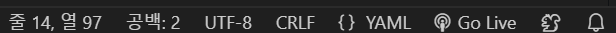
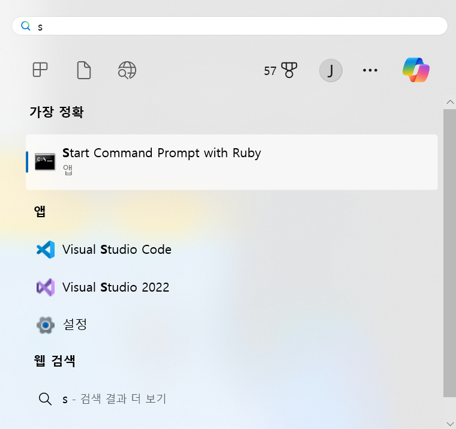
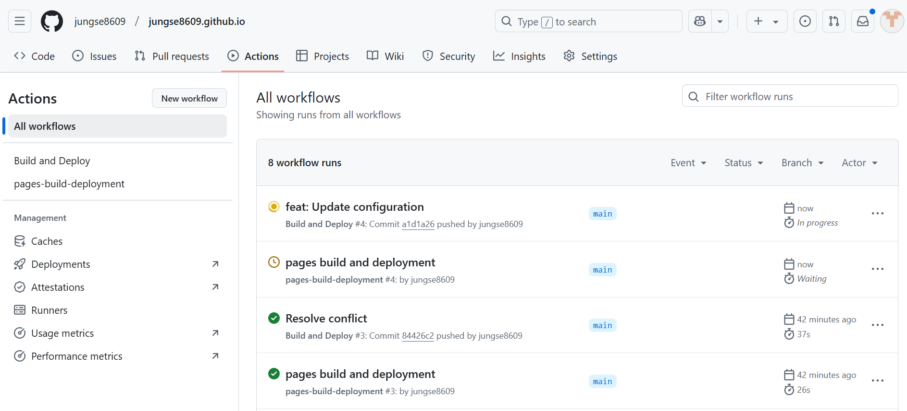
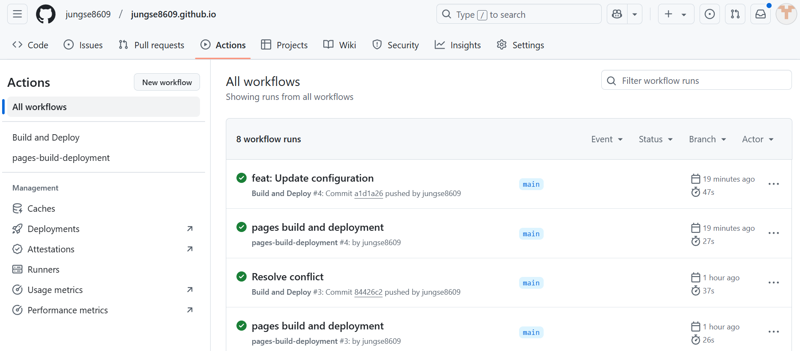
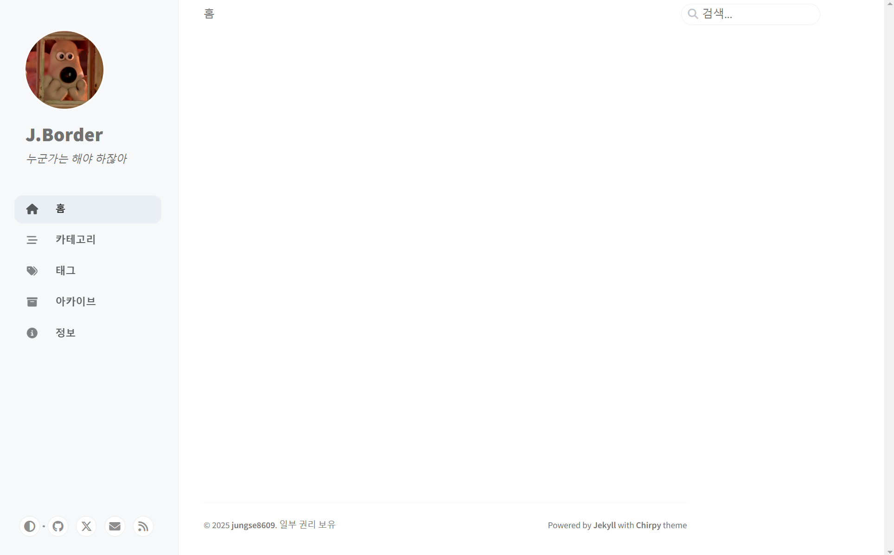

# 1. 페이지 설정

---

*_config.yml*  파일을 개인에 맞게 설정하자. [Starter](https://chirpy.cotes.page/posts/getting-started/)의 Configuration을 참고했다.

- `url`
- `avatar`
- `timezone`
- `lang`

*_config.yml* 파일을 열어 위의 사항들을 본인에 맞게 설정하면 된다.

주석에 옵션 메뉴들이 나와있으니 참고해 설정하면 된다.

> 여기서 에러가 발생
> 
> 
> ```powershell
> jekyll 4.4.1 | Error:  (C:/-/_config.yml): invalid leading UTF-8 octet at line 1 column 1
> ```
> 
> UTF-8 설정이 안 됐다는 것이다. 나같은 경우는 *_config.yml* 파일을 vscode에서 수정하였는데 이 과정에서 인코딩 EU-KR로 바껴서 생긴 문제였다.
> 
> 
> 
> vscode 하단에 보면 인코딩 방식을 설정하는 곳이 있다. 없다면 구글에 “vscode 인코딩 변경” 이라고 검색하자.
> 
> 인코딩을 UTF-8로 수정하니 다시 제대로 되더라.
> 

# 2. 페이지 수정 후 로컬에서 확인

---

페이지 수정 후 로컬에서 확인하려면 전처럼 루비 프롬프트에서 지킬 서버를 켜보면 된다.

1. 루비 프롬프트를 키자.

    

2. 내 local 위치로 이동한다. 본인 경로로 가면 된다.

    ```powershell
    $ cd C:\Users\USER\local_repo\jungse8609.github.io
    ```

3. jekyll 서버를 동작시킨다.

    ```powershell
    $ bundle exec jekyll s
    ```

그 후 [*http://127.0.0.1:4000/*](http://127.0.0.1:4000/) 에 들어가서 변경 사항을 확인 후 제대로 됐다면 remote에 push하면 되겠다.

# 3. 변경된 깃허브 페이지 확인

---

깃허브의 Actions 탭에 들어가면 최근 변경 사항이 페이지에 적용되는 과정을 확인할 수 있다. push 후에 진행되는 과정을 살펴보자.

build 중인 모습


build가 정상적으로 완료된 모습


정상적으로 빌드되면 드디어 나만의 페이지가 생성에 성공한 것이다!! 박수~~~


> remote에 push 한다고 바로 되는게 아니고 5~10분 정도의 시간이 필요한 것 같다. 고장난 것이 아니니 진정할 것~~(일단 난 바로 흥분. 외않되~~)~~
> 

# 4. 결론

---

우여곡절이 많은데 그래도 하면서 느낀 점은, 변경점이 바로바로 보인다는 점에서 너무 재미있다. 예상 못한 버그 해결은 힘들지만 변해가는 내 페이지를 보면 뿌듯해진다.

즉각적인 변경점이 보이는게 게임이랑 비슷하기도 하다.

다음에는 글을 올리는 것을 목표로 해보자