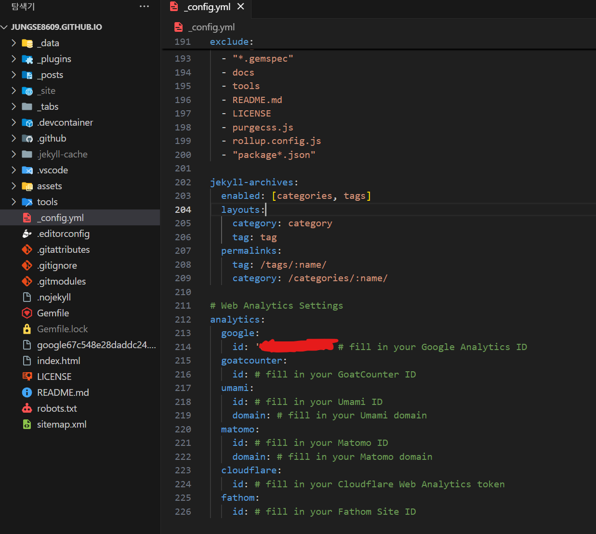

# 0. 서론

---

이번에는 구글과 페이지를 연동하는 것들을 해볼 것이다. 세 가지를 할 건데 아래와 같다.

- **Google Search Console** : 사이트의 검색 트래픽 및 실적을 측정, Google 검색결과에서 사이트가 돋보이게 할 수 있다.
- **Google Analytics** : 광고 ROI 측정, 플래시, 동영상 및 소셜 네트워크 사이트와 애플리케이션을 추적할 수 있다.
- **Google Adsense** : 광고주가 설정 및 선택한 사항을 기반으로 광고 공간을 통해 수익을 최대한 창출할 수 있도록 돕는다.

내용이 길긴 한데 구글이라 참 따라가기 쉽게 만들어 놨다. 아래 내용만 따라가면 문제 없이 세 가지다 연동 가능할 것이다.

# 1. Google Search Console

---

> 소목차
> 
> 1. Google Search Console과 깃허브 페이지 연결
> 2. 깃허브 페이지 소유권 확인
> 3. sitemap 과 robot.txt 설정
>    [sitemap과 robots.txt에 대해서]()
> 4. 연동 확인

## Google Search Console과 깃허브 페이지 연결

---

[Google Search Console](https://search.google.com/search-console/about?hl=ko&utm_source=wmx&utm_medium=wmx-welcome)로 이동하자


URL 접두어에 자신의 깃허브 페이지 주소를 넣는다.


## 깃허브 페이지 소유권 확인

---

우선 아래 파일을 다운받자.


다운받은 파일을 깃허브 페이지에 복사한다. 이때 위치는 *_config.yml* 과 같은 위치이다.


그 후 정상적으로 push하고 깃허브 페이지에 적용되면 아래처럼 소유권이 확인됐다는 창을 볼 수 있다.


## sitemap 과 robot.txt 설정

---

깃허브 페이지의 site-map을 제출함으로써 블로그의 페이지들이 Google 검색에 잘 노출되게 한다.

Gemfile에 아래 문구를 추가해주자.

```powershell
gem 'jekyll-sitemap'
```


위에 작성한 코드는 플러그인으로 루비 프롬프트에서 명령어를 통해 설치해야 한다.

루비에 아래 명령어를 작성하자.

```powershell
$ bundle install
$ bundle info jekyll-sitemap # 설치됐는지 확인용
```


위 플러그인이 site-map에 대한 xml 파일을 자동으로 생성시켜 준다.

아래의 명령어로 서버를 열자.

```powershell
$ jekyll serve
```

그리고 http://localhost:4000/sitemap.xml 으로 접속하면 자동 생성된 xml 페이지가 보인다. 이 내용 전체를 복사하자.


복사한 내용은 깃허브 페이지에 *sitemap.xml* 파일 안에 추가해준다. 위치는 마찬가지로 *_config.yml* 과 같은 위치이다.


마지막으로 *robots.txt* 파일을 생성하고 아래 코드를 넣으면 끝난다. 주소는 본인 페이지로 한다.

```powershell
User-agent: *
Allow: /

Sitemap: https://jungse8609.github.io/sitemap.xml
```


## 연동 확인

---

지금까지 수정한 내용을 깃허브 페이지에 push하고 console에 올리자.

그리고 [Google Search Console](https://search.google.com/search-console/about?hl=ko&utm_source=wmx&utm_medium=wmx-welcome)의 Sitemaps 에 들어가 sitemap.xml을 제출하면 끝난다.


등록된 후 7일 이내에 검색 엔진에 노출될 것이다.

정말 마지막으로 Search Console 링크를 연결하자.

옵션에서 제일 밑에 있는 Search Console 링크 클릭


연결 버튼 클릭


그 후에는 단계 별로 설정하여 google search console 링크와 연동하면 된다.

# 2. Google Analytics

---

> 소목차
> 
> 1. 계정 생성 및 속성 설정
> 2. 깃허브 페이지에 추적 코드 추가

## 계정 생성 및 속성 설정

---

[Google Analytics](https://analytics.google.com/analytics/web/)로 이동하자.

나는 이미 Google Analytics 계정이 있었기에 기존의 계정과 속성을 수정하였다.

계정 이름을 수정했다.


속성 이름, 보고 시간대, 표시 통화를 수정했다.


여기까지 마쳤다면 홈으로 돌아온다.

## 깃허브 페이지에 추적 코드 추가

---

홈으로 돌아왔다면 데이터 수집 시작하기가 바로 뜰 것이다.

여기서 웹을 선택하고 본인의 웹사이트(나의 경우 jungse8609.github.io)로 설정하고 스트림 이름은 임의로 쓰면 된다.

그럼 스트림 세부 정보에 **측정 ID**라는 것을 찾을 수 있을 텐데 이를 복사한다.

복사한 ID를 *_config.yml*의 analytics: google: id: 에 넣어준다. 



그리고 remote에 push 해준다.

여기까지 잘 따라왔다면 아래 사진처럼 보일 것이다. 이제 내 깃허브 사이트에 대한 정보를 여기서 확인할 수 있다.


# 3. Google Adsense

---

## 가입

---

[Google Adsense](https://analytics.google.com/analytics/web/)로 이동하자. 그리고 가입을 진행하면 된다.


구글은 참 이런 UI를 직관적으로 잘 만드는 것 같다. 그냥 하라는데로 쭉 가입 절차를 따라가자.

가입 정보, 주소, 결제 프로필 등을 등록하는데 나는 구글 플레이에 이미 결제 중인 프로필이 있어서 바로 패스했다.

## 소유권 확인

---

마찬가지로 소유권 확인을 위한 절차를 진행하는데 아래 *Ads.txt 스니펫* 코드를 복사하자.


~~그리고 깃허브 페이지 루트 폴더에 *Ads.txt* 파일을 만들고 push 하자.~~

*Ads.txt*가 아니라 *ads.txt*로 진행해야 한다. 아니면 제대로 인식이 안 된다.


깃허브 페이지에 들어갈 때까지 기다리자


*ads.txt 파일을 게시함*에 체크하고 확인을 누르자.


정상적으로 들어갔다면 소유권을 확인할 수 있다.


다음은 검토 요청을 하자


여기까지 하면 끝인데 검토 과정은 몇 일에서 몇 주까지 걸릴 수 있다고 하고, 심사 결과 신청이 거부될 수도 있다.

거부되면 그때 생각해보자…

# 4. 결론

---

세 가지 구글과 연동 과정을 모두 마쳤는데 애드센스는 일단 검토 요청 중이고 분석은 잘 되고 검색 관련도 시간이 좀 걸린다. 일단 구글이 UI를 잘 만들어서 크게 어렵지는 않았다.

이제 정말 글만 쓰면 된다 !!