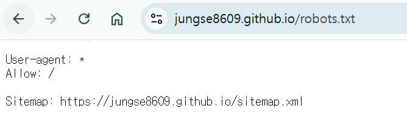

# 문제 상황
 
---

깃허브 페이지에 올릴 글을 노션에서 1차 작업 후 옮기고 있다.

노션에서 글은 그대로 복사해서 붙이고, 이미지는 추출하기로 일괄 저장할 수 있다.

이때 자동 지정되는 이미지 네이밍은

image, image 1, image 2, …

이다.

이때 포스트는 아래 위치에 저장이 되고

```markdown
(깃허브페이지)/_posts/(filename).md
```

이미지들은 아래 위치에 저장이 된다.

```markdown
(깃허브페이지)/assets/img/posts/(filename)/image
```

예를 들어 깃허브 페이지에 글을 올리려면 아래 형식처럼 써야하는데

```markdown

```

글을 복사하면 아래처럼 가져와진다.

```markdown

```

# 문제 이해

---

노션에 저장되는 이미지의 이름은 모두 

`` 이다.  이를 

`/image (index).png)` 로 일괄적으로 바꿔야 한다.

나중에 이름 수정할 일이 있을 수도 있으니 그냥 `![image.png]` 가 접두사로 있는 문장은 모두 수정하자.

이런거 잘하는 건 파이썬이니까 파이썬으로 문제 해결을 해보자

# 문제 풀이

---

```python
import re

def rename_images_in_markdown(md_file_path: str, post_name: str):
    # 1. 마크다운 파일 내용 읽어오기
    print(md_file_path)
    with open(md_file_path, "r", encoding="utf-8") as f:
        content = f.read()
    
    # 2. 새로 쓸 내용 초기화
    new_content = content

    # 3. 해당 패턴을 모두 찾는다. (정규식은 예시에 맞춰 구성)
    pattern = r"!\[image\.png\]\([^)]+\)"
    matches = re.findall(pattern, content)

    # 4. 찾은 순서대로 치환
    count = 0
    for match in matches:
        # 첫 번째 이미지는 image.png, 이후는 image 1.png, image 2.png ... 식으로 만들기
        if count == 0:
            new_file_name = "image.png"
        else:
            new_file_name = f"image {count}.png"
        
        # 치환될 새 경로
        replacement = f""
        
        # 한 번에 하나씩(순차적으로) 치환
        new_content = new_content.replace(match, replacement, 1)
        count += 1

    # 5. 최종 수정 내용을 원본 파일에 다시 덮어쓰기
    with open(md_file_path, "w", encoding="utf-8") as f:
        f.write(new_content)

if __name__ == "__main__":

    filename = "2025-03-09-sitemap_and_robots"
    rename_images_in_markdown("_posts/" + filename + ".md", filename)
```

간단히 설명하자면, main의 *filename* 을 내가 작업하고 있는 포스트 이름으로 바꾸면 지정된 경로의 파일을 찾아 수정하는 것이다.

이때 보장되어야 하는 것은

1. `포스트 파일 이름`과 `이미지가 저장된 폴더 이름` 이 동일해야 한다.
2. 위 코드는 그저 image, image 1 ~ image N 까지의 이미지를 순서대로 넣을 뿐이기 때문에 이미지의 순서는 개발자가 잘 확인해야 한다.

# 결론

---

사진이 많아지니까 반복 작업이 생겨서 귀찮았다. 그게 이 파이썬 코드를 만드는 것보다 귀찮아서 이렇게 만들게 됐다. 이제 효율적으로 블로그 글을 써보자~