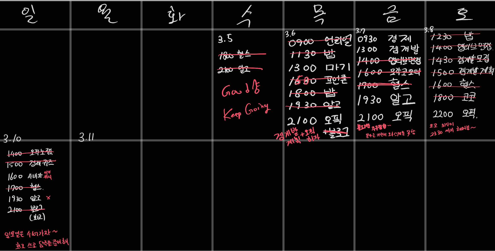

# 3월 1주차를 돌아보며

---

이번주 수요일부터 매일 일과 계획표를 세우고 그것에 맞게 살아보자 라는 마음으로 지냈다. 

못 지킨 계획들은 내가 블로그 열중한다고 뒤로 미루거나 본가에 납치 당한 것, 회식이 길어진 것들이다.

다만 크진 않다고 생각한다. 그냥저냥 놀면서 날린 건 아니니까.

이벤트도 많이 있었다. 게임 개발 동아리 프로그래머 추가 모집도 했고, 코코 동아리 회식에 운영진 참여 결정까지.. 그리고 앱티브 합격도 했고. 뭔가 일들을 굉장히 벌리는 듯 하지만 할 수 있겠지. 어차피 해야 해!

여기에 블로그, 모각코, 오스트리아… 그리고 3월 말에 졸과까지 포함되면 ㅋㅋㅋㅋㅋㅋ 죽어라

갓생도 잘 살고 있다. 7시 기상은 이미 3주차 이고 하루 일과대로 생활하는 것도 뭐… 5일차이긴 한데 어느 정도 잘 지키니까 괜찮지. 헬스도 꾸준히 하고 있고 러닝도 다시 재개를 해보려 한다. 날이 살짝 춥긴 한데 견딜만 하니까.

가족, 인간관계도 자기계발 못지 않게 중요한 것 같다.

이번 주가 이렇게 열심히 살고자 한 첫 주차이고, 오늘은 그냥 주저리 주저리 쓰기만 했는데, 앞으로 회고를 어떻게 할지 , 오늘은 이런 것들을 정해보자.

# 회고를 어떻게 작성할까

---

회고라고 하면 한 주 동안 계획을 잘 지켰는지 확인하고, 못 지킨 부분은 왜 못 지켰는지, 스스로 점검하기 위한 것이다.

프로젝트 같은 경우는 큰 일정이 이미 나와 있으니, 이런 것들을 목표로 세우자. 마기 개발 같은 경우는 6월달까지의 계획이 세워져 있기에 이 부분을 계획에 설정하면 되겠다.

프로젝트 일정 외에 개인적인 기분 유지나 생각들도 쓰자. 이것도 회고니까

크게 나누자면

1. TODO : 한 주간 주어진 숙제를 확인하자
2. KEEP : TRY 에서 나온 것들을 지키는지 확인하자
3. TRY : 학교, 일상 생활에서 지키고 싶은 것들을 쓰자 
4. QUESTION : 다음 주의 나에게 하는 질문을 하자

이 정도 인 것 같다.

일단 이렇게 회고를 써보고 상황보고 형식은 바꾸던가 하자.

# 25년 3월 2주차를 바라보며

---

### TODO

레이어 : 전당포 보스 완성

### KEEP

헬스 루틴대로 진행(최소 4회 이상)

7시 기상

평화롭게 살자 스트레스 없이 누군가는 해야 해

### QUESTION

계획은 잘 지켜졌는가? 안 지켜졌다면 왜인가?