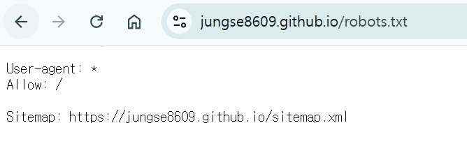

# 서론

---

Google Search Console과 깃허브 페이지를 연동하며 sitemap, robots,txt 들을 추가하고 제출하였다. 과연 이것들이 하는 역할이 무엇인지 정리하려고 한다.

sitemap, robots.txt는 seo, search engine optimization의 뿌리가 된다. 아래에서 한 번 알아보도록 하자.

 

# robots.txt

---

검색엔진은 웹사이트에서 가장 먼저 접근하는 것이 바로 `robots.txt` 파일이다.

누구나 접근할 수 있고 당장 *(아무 도메인)/robots.txt* 을 검색하면 접근 가능하다.

robots.txt는 검색엔진 로봇의 접근을 제어할 수 있다. 아무 설정하지 않으면 모든 검색 엔진 로봇이 우리의 페이지를 보여줄 것이다.

다만 검색 엔진이 로직 점수를 반영하기에 전문적인 파일로 설정하는게 올바르다고 한다.

### 전문적으로 설정해야 하는 이유

---

만약 로그인 페이지가 검색 엔진에 노출된다고 하자. 그럼 이 페이지의 이탈율은 굉장히 높을 것이다.

이탈율(Bounce Rate)가 높으면 로직 점수가 낮아진다. 따라서 이러한 페이지는 검색 엔진으로부터 차단해야 한다.

 

# sitemap.xml

---

XML 사이트맵은 검색 엔진 봇이 사이트 구조를 효율적으로 파악할 수 있게 해주는 목차와 같다고 한다.

이를 통해 페이지가 검색에 잘 노출되게 한다.

 

### 주의사항

---

XML 사이트맵은 반드시 UTF-8로 인코딩 되어야 한다.