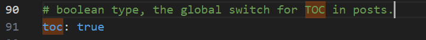
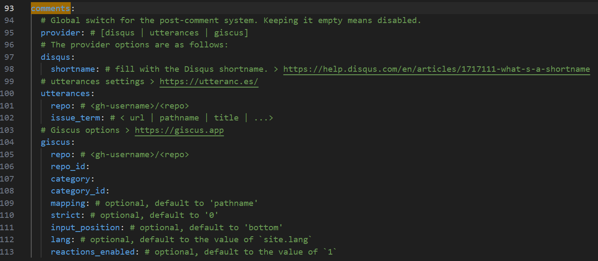
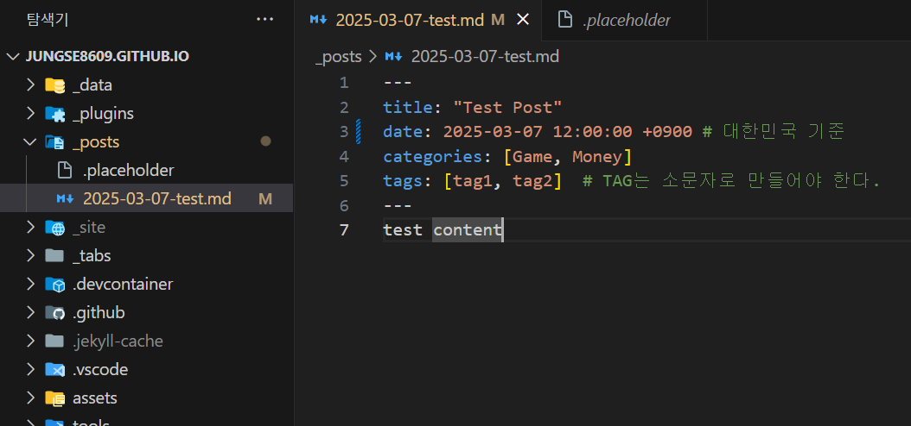
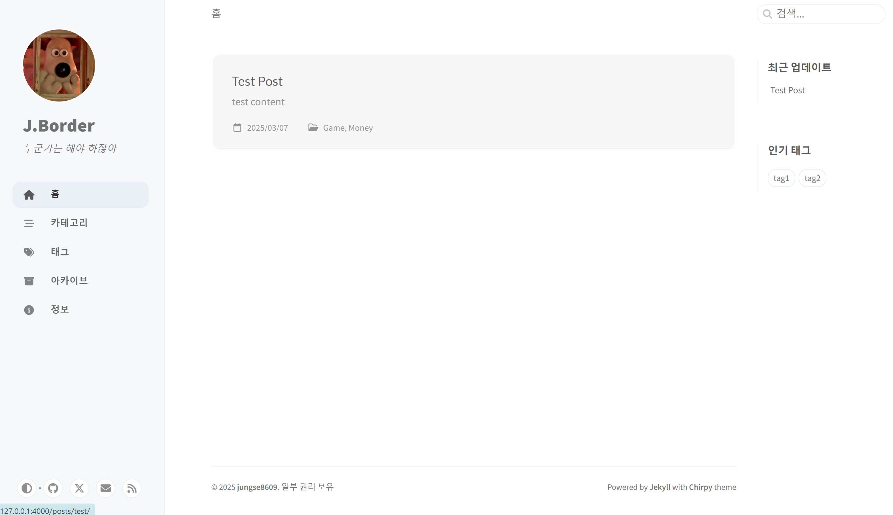
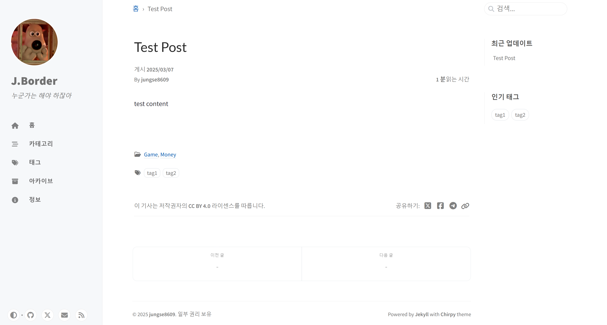
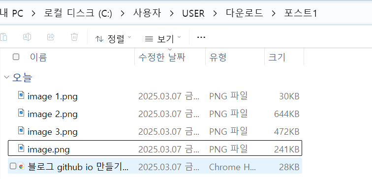
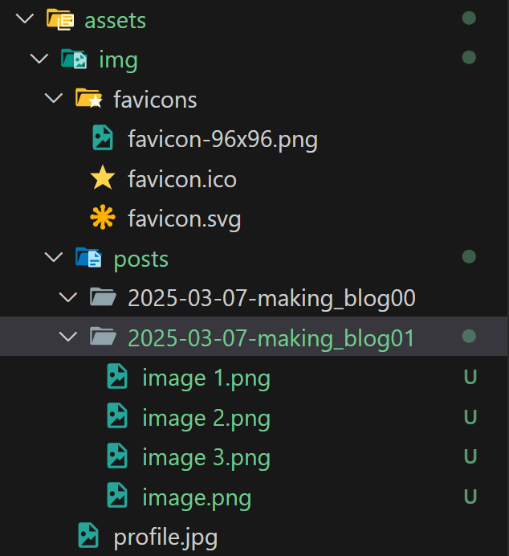

# 0. 서론

---

이제 정말 글을 올려보자. 글 하나를 올리는 것을 목표로 달려보겠다.

# 1. 글 작성 가이드

---

[Writing a New Post](https://chirpy.cotes.page/posts/write-a-new-post/)  chirpy 에서 제공하는 가이드라인을 따라가보자

## Naming과 Path

---

Naming 형식 : `YYYY-MM-DD-TITLE.EXTENSION`

Path : `_post/`

naming시 확장자는 `md` 혹은 `markdown`으로 지정한다.

## Front Matter

---

글 작성할 때는 아래의 형식으로 Front Matter를 작성해야 한다.

```markdown
---
title: TITLE
date: 2025-03-07 12:00:00 +/- TTTT
categories: [TOP_CATEGORIE, SUB_CATEGORIE]
tags: [TAG]	tag1, tag2	# TAG는 소문자로 만들어야 한다.
---
```

### Timezone of date

---

더 정확한 시간을 설정하기 위해 *_config.yml*  의 *timezone* 을 설정하고, Front Matter의 date 필드에도 post timezone을 제공해야 한다. `+/- TTTT` 의 형식으로. (`+0800`)

### Catergories & Tag

---

각 포스트의 카테고리는 2개로 구성되고 태그는 제한없다.

### 예시

---

```yaml
---
title: Test Post
date: 2025-03-07 12:00:00 +0800
categories: [Game, Money]
tags: [tag1, tag2]	# TAG는 소문자로 만들어야 한다.
---
```

### Table of Contents

---

기본적으로 *Table of Content(TOC)* 는 포스트 오른쪽 패널에 위치한다. 

이 기능은 *_config.yml* 에서 설정할 수 있다.



만약 해당 포스트만 *TOC* 기능을 끄고 싶다면 *FrontMatter*에서 *toc: false* 로 설정하면 된다.

```yaml
---
toc: false
---
```

### Comments

---

*TOC*와 비슷하게 *Disqus comments*  가 각 포스트마다 내장되어 있고, 마찬가지로 *_config.yml* 에서 설정 가능하고 하나의 포스트에서만 기능을 끄고 싶다면 *FrontMatter*에서 설정하면 된다.



```yaml
---
comments: false
---
```

### Mathematics

---

성능을 위해 기본 설정은 꺼져있으나 아래 코드로 켤 수 있다.

```yaml
---
math: true
---
```

### Mermaid

---

*Mermaid*는 표 생성 도구이다. 아래 코드로 켤 수 있다.

```yaml
---
mermaid: true
---
```

### Images

---

**Preview image**

포스트 최상단 이미지는 아래처럼 설정해 넣을 수 있다.

```yaml
---
image: /path/to/image-file
---
```

**Image caption**

이미지 삽입 후 아래처럼 *Italics*를 추가하면 이미지 캡션을 달 수 있다. 이미지 하단에 달린다.

```markdown

_Image Caption_
```

**Image size**

`width` 를 추가해 이미지 사이즈를 설정하자

```markdown
{: width="400px"}
```

정렬을 설정할 수 있다. 기본 위치는 `centered` 이고, `left`, `right`, `normal` 이 있다.

```markdown
{: width="350" class="normal"}
{: width="350" class="left"}
{: width="350" class="right"}
```

이미지 위치를 정하면 `Image caption`은 달 수 없다.

### Pinned post

---

페이지 메인 화면에 특정 게시물을 고정할 수 있다. 순서는 포스팅 날짜가 최신일 수록 위로 올라온다.

```yaml
---
pin: true
---
```

### Code block

---

마크다운 문법 ````` 으로 코드 블럭을 생성할 수 있다.

### Specific language

---

````language` 를 통해 line number와 syntax highlight를 갖는 코드 블럭을 생성할 수 있다.

### Liqued codes

---

liquid code를 추가하고 싶으면 `` 와 `` 로 감싸주면 된다.

```markdown

  This product's title contains the word Pack.

```

### 페이지 링크

---

페이지 링크를 달고 싶으면 아래처럼 작성하면 된다. 

링크하고 싶은 포스트 제목을 “2025-03-09-test” 라고 하자.

```python

[테스트 타이틀]()

```

# 2. 글 작성 예시

---

아래는 테스트로 글을 작성한 예시 코드이다.



이를 루비 프롬프트에서 지킬 서버를 실행해 테스트 해보자

```bash
$ bundle install        # bundle 설치
$ bundle exec jekyll s  # 변경 사항 확인
```

테스트해보면 글이 잘 생성된 것을 확인할 수 있다!!



글 내부 모습도 잘 나오는 모습



# 3. 포스트에 이미지 추가하기

---

`assets/img/` 폴더에 `posts` 폴더를 추가하자. 그리고 여기 이미지들을 추가한다.

### 노션의 이미지 한 번에 다운로드 받기

---

현재는 깃허브 페이지 작업을 노션에서 작성 후 옮기는 방식으로 사용하고 있다.

노션의 메뉴에서 html로 추출하면 아래처럼 이미지를 한 번에 다운 받을 수 있다.



### 포스트에 이미지를 넣는 법

---

이미지는 아래의 위치에 넣을 것이다.

```
./assets/img/posts/(포스트이름)/(넣을이미지).png
```

위의 형태로 폴더를 만들고 이미지를 복사하자. 나 같은 경우는 아래처럼 만들어졌다.



이미지를 내가 설정한 경로로 잘 가져왔다면 이제는 페이지에서 수정하면 된다.

나는 

```

```

# 결론

---

이제 테스트도 끝났으니 노션에 써놓은 글들을 마구 올리도록 하자!! 그리고 위의 가이드라인 따라서 깃허브 페이지를 꾸미는 작업도 해보자.

사진들 올리려면 근데 시간 정말 오래 걸리겠다… 하지만 해야지 어쩌겠어

다음에는 파비콘을 수정해보자!! 

파비콘 : 탭 왼쪽의 그림

---

25.03.07 13:38

~~서버에서는 페이지가 잘 나오는데 실제 깃허브 페이지에는 적용되지 않는 문제~~

⇒ 페이지에 적용되려면 시간이 걸리는 듯 하다. 5~10분 걸리는 듯 하다