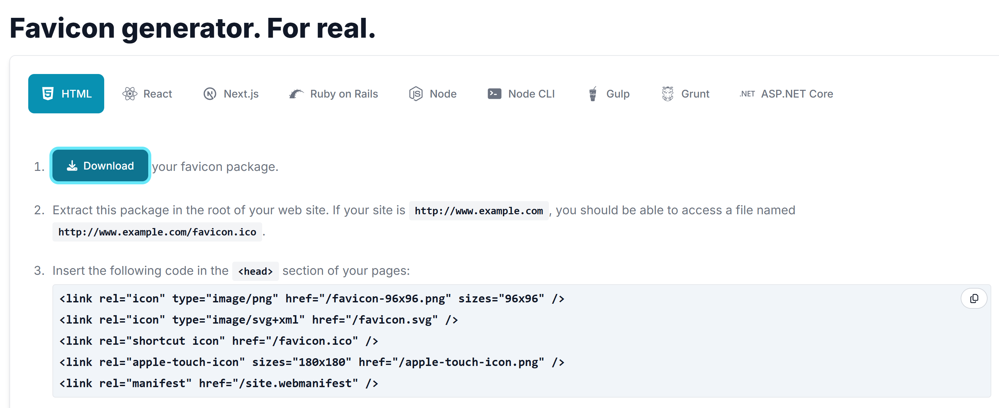
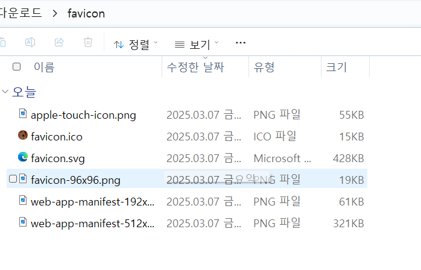
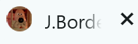

# 1. 파비콘 커스터마이징 하기

---

깃허브 페이지의 파비콘을 원하는 이미지로 바꿔볼 것이다.
[Customize the Favicon](https://chirpy.cotes.page/posts/customize-the-favicon/) 의 튜토리얼을 따라가자

## Generate the favicon

---

우선 512X512 사이즈 PNG, JPG, SVG 이미지 파일을 준비하자.

만약 내 사진이 사각형이라면 이를 무료로 원형으로 잘라주는 [사이트](https://crop-circle.imageonline.co/)이다.

준비한 이미지로 파비콘을 생성할 수 있는 [사이트](https://realfavicongenerator.net/) 이다.

나의 귀여운 그로밋 파비콘을 넣어보자


# Download & Replace

---

이미지를 넣고 NEXT로 가면 이런 창이 뜨는데 여기서 Download를 눌러 favicon.zip 파일을 다운받자.



다운 받은 파일의 압축을 풀고 아래 파일은 삭제해주어야 한다. 

- browserconfig.xml
- site.webmanifest

나는 *site.webmanifest* 만 있기에 이것만 삭제해줬다.



그런데 찾아보니 이걸 그냥 `/assets/img/favicon` 에 `.ico` 와 `.png` 만 넣으면 된다고 한다.

그래서 해보니 잘 동작하지 않는다. 이제 해결을 해볼까ㅣ??/

발견한 문제 : robots.txt가 중복 존재한다.

`C:/Users/USER/local_repo/jungse8609.github.io/_site/robots.txt`

`C:/Users/USER/local_repo/jungse8609.github.io/robots.txt`

```bash
Conflict: The following destination is shared by multiple files.
			    The written file may end up with unexpected contents.
			    C:/Users/USER/local_repo/jungse8609.github.io/_site/robots.txt
			     - assets/robots.txt
			     - C:/Users/USER/local_repo/jungse8609.github.io/robots.txt
```

_site가 뭔데? 얘는 .gitignore 에 등록돼서 깃허브에 올라가지도 않아

> _site 는?
> 
> 
> Jekyll 이 변환 작업을 마친 뒤 생성된 사이트가 저장되는 (디폴트) 경로이다. 대부분의 경우, 이 경로를 `.gitignore` 에 추가하는 것은 괜찮은 생각이다.
> 

위의 설명대로 _site에는 원본이 자동으로 생성된다.

그래서 `_config.yml` 파일에서 robots.txt를 무시하게 수정했다.

```yaml
exclude:
  - "*.gem"
  - "*.gemspec"
  - docs
  - tools
  - README.md
  - LICENSE
  - purgecss.js
  - rollup.config.js
  - "package*.json"
  - robots.txt
```

Conflict는 해결이 됐는데 파비콘은 여전히 적용이 안 된다. 이 문제가 아니였나 보다.

아니 `/assets/img/favicon` 가 아니고 `/assets/img/favicons`  여서 안 된 거였다. 뻐킹

경로를 맞게 설정하니 잘 적용 된다.



# 결론

---

이제 파비콘까지 넣었으니 노션의 내용들을 깃허브 페이지에 옮기자