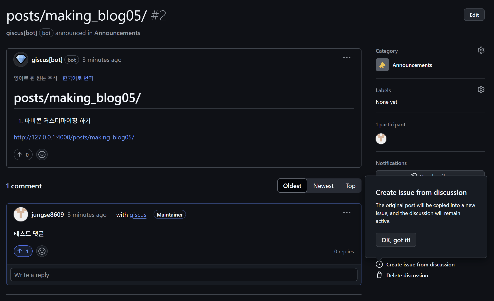

# 0. 서론

---

글 올리기는 성공했다. 하지만 아직 사진은 넣지 못했다.

그래서 오늘은 사진을 추가해볼 것이다.

내 글을 멋지게 만들어 보자

# 1. 포스트에 이미지 추가하기

---

`assets/img/` 폴더에 `posts` 폴더를 추가하자. 그리고 여기 이미지들을 추가한다.

### 노션의 이미지 한 번에 다운로드 받기

---

현재는 깃허브 페이지 작업을 노션에서 작성 후 옮기는 방식으로 사용하고 있다.

노션의 메뉴에서 html로 추출하면 아래처럼 이미지를 한 번에 다운 받을 수 있다.


### 포스트에 이미지를 넣는 법

---

이미지는 아래의 위치에 넣을 것이다.

```
./assets/img/posts/(포스트이름)/(넣을이미지).png
```

위의 형태로 폴더를 만들고 이미지를 복사하자. 나 같은 경우는 아래처럼 만들어졌다.


이미지를 내가 설정한 경로로 잘 가져왔다면 이제는 페이지에서 수정하면 된다.

나는 

```

```

# 2. 폴더 위치 찾기

---

앞의 글들을 따라왔다면 Chirpy-starter를 보고 jekyll 설치를 했을텐데, 이러면 아마 _scss 폴더를 찾을 수 없을 것이다. 다른 곳에 저장되기 때문이다.

## 로컬에 설치된 jekyll-theme-package 위치 찾기

---

`jekyll-theme-chirpy` 의 Gem 패키지가 다른 곳에 설치되어 있을 것이다.

아래 명령어로 위치를 찾자.

```bash
$ bundle info --path jekyll-theme-chirpy
$ C:/Users/USER/.local/share/gem/ruby/3.3.0/gems/jekyll-theme-chirpy-7.2.4
```

위 경로를 가면 아래 사진처럼 `_data`, `_sass` 등 내가 찾던 폴더들이 존재하는 걸 볼 수 있다.


이제 깃허브 페이지에 Gem 패키지와 동일하게 폴더 구성을 만들어주고, 수정하고 싶은 파일을 복사해서 작업을 하면 된다.

??? : 그렇게 간단한가요?

복사해 가져온 파일들은 원본 Gem 패키지의 파일들을 오버라이드하기 때문에 그냥 가져와 수정해 쓰면 된다.

원본의 `locales` 에서 `en`과 `ko-KR`을 가져왔다.


연동된다는 것을 확인해보자. en.yml 파일에서 home의 value 값을 수정해보았다.


위처럼 HomeEE 로 수정하였고, 이제 페이지에서는 확인해보면 잘 연동되는 것을 확인할 수 있다.

어디 Capital 로만 써지게 설정이 돼있는 것 같은데 이건 나중에 또 찾아보자.


# 3. 폰트 설정

---

지금 내 블로그 글들이 너무 못생겼다. 그래서 폰트를 설정하려고 한다.

우선 Chirpy 공식 깃허브에서 다운받은 파일에서 _sass 폴더를 그대로 내 깃허브 페이지에 복사했다.


[구글 폰트](https://fonts.google.com/)에서 원하는 글꼴을 찾자. 나는 일단 많이 쓴다는 *Noto Sans Korean*을 선택했다.



일단 글로 정리하고 나중에 사진 넣든가 하자

/_sass/abstracts/_variables.scss에 폰트가 정의되어 있다. 다른 파일에서 이 스크립트를 가져와서 그대로 쓰고 있으니 얘만 수정하면 될 듯 하다. 어 바뀌네

```scss
/* fonts */

$font-family-base: 'Source Sans Pro', 'Microsoft Yahei', sans-serif !default;
$font-family-heading: 'Source Sans Pro', 'Microsoft Yahei', sans-serif !default;
```

아 이거 scss 파일들 구조 파악하고 문법 익히고 하는거 시간 좀 걸리겠다… 일단 댓글을 하고 생각을 더 해보자. 이거는 다른 글에 하나에 모아서 해결해야 겠다.

# 4. 댓글 기능 추가

---

[giscus](https://giscus.app/ko) 에서 가이드를 따라 나의 테마 스크립트를 가져오자. 들어가서 여러가지 선택하면 아래와 같은 코드를 뱉어준다. 일단은 그렇게 고민하진 않았고 적당히 선택해줬다.

```scss
<script src="https://giscus.app/client.js"
        data-repo="jungse8609/jungse8609.github.io"
        data-repo-id="R_kgDOOD7ikg"
        data-category="General"
        data-category-id="DIC_kwDOOD7iks4Cn0eQ"
        data-mapping="pathname"
        data-strict="0"
        data-reactions-enabled="1"
        data-emit-metadata="0"
        data-input-position="bottom"
        data-theme="noborder_gray"
        data-lang="ko"
        crossorigin="anonymous"
        async>
</script>
```

여기서 `repo`, `repo-id`, `category`, `category-id` 를 *_config.yml* 파일의 comment에 붙이자.

```c
comments:
  # Global switch for the post-comment system. Keeping it empty means disabled.
  provider: giscus # [disqus | utterances | giscus]
 
  # Giscus options > https://giscus.app
  giscus:
    repo: jungse8609/jungse8609.github.io # <gh-username>/<repo>
    repo_id: R_kgDOOD7ikg
    category: General
    category_id: DIC_kwDOOD7iks4Cn0eQ
    mapping: # optional, default to 'pathname'
    strict: # optional, default to '0'
    input_position: # optional, default to 'bottom'
    lang: # optional, default to the value of `site.lang`
    reactions_enabled: # optional, default to the value of `1`
```

이렇게 하면 놀랍게도 댓글 기능 구현이 끝났다. 이제 댓글을 달 수 있고, 여기 달린 댓글은 내 깃허브의 discussion에 저장된다. 

+ 나는 깃허브에 discussion 설정을 하고 진행해서 에러가 안 났는데, discussion이 없으면 에러가 발생할 수도 있다고 한다.  당황하지 말고 discussion을 만들어주면 된다. 아님 댓글을 하나 달면 자동으로 생긴다고도 한다.(안 해봐서 모르겠음)


discussion에 저장된 모습도 확인할 수 있다.


댓글 꾸미는 것도 나중에 하자. 설정도 바꿀게 있으면 바꾸고~