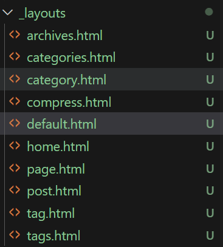

## 서론

---

여러가지 기능들을 추가해보자.

언어 설정, 폰트 설정, 댓글 기능 추가, Table of content 수정

## 폴더 위치 찾기

---

앞의 글들을 따라왔다면 Chirpy-starter를 보고 jekyll 설치를 했을텐데, 이러면 아마 _scss 폴더를 찾을 수 없을 것이다. 다른 곳에 저장되기 때문이다.

### 로컬에 설치된 jekyll-theme-package 위치 찾기

---

`jekyll-theme-chirpy` 의 Gem 패키지가 다른 곳에 설치되어 있을 것이다.

아래 명령어로 위치를 찾자.

```bash
$ bundle info --path jekyll-theme-chirpy
$ C:/Users/USER/.local/share/gem/ruby/3.3.0/gems/jekyll-theme-chirpy-7.2.4
```

위 경로를 가면 아래 사진처럼 `_data`, `_sass` 등 내가 찾던 폴더들이 존재하는 걸 볼 수 있다.


이제 깃허브 페이지에 Gem 패키지와 동일하게 폴더 구성을 만들어주고, 수정하고 싶은 파일을 복사해서 작업을 하면 된다.

??? : 그렇게 간단한가요?

복사해 가져온 파일들은 원본 Gem 패키지의 파일들을 오버라이드하기 때문에 그냥 가져와 수정해 쓰면 된다.

원본의 `locales` 에서 `en`과 `ko-KR`을 가져왔다.


연동된다는 것을 확인해보자. en.yml 파일에서 home의 value 값을 수정해보았다.


위처럼 HomeEE 로 수정하였고, 이제 페이지에서는 확인해보면 잘 연동되는 것을 확인할 수 있다.

어디 Capital 로만 써지게 설정이 돼있는 것 같은데 이건 나중에 또 찾아보자.


## 폰트 설정

---

지금 내 블로그 글들이 너무 못생겼다. 그래서 폰트를 설정하려고 한다.

우선 Chirpy 공식 깃허브에서 다운받은 파일에서 _sass 폴더를 그대로 내 깃허브 페이지에 복사했다.


[구글 폰트](https://fonts.google.com/)에서 원하는 글꼴을 찾자. 나는 일단 많이 쓴다는 *Noto Sans Korean*을 선택했다.


일단 글로 정리하고 나중에 사진 넣든가 하자

/_sass/abstracts/_variables.scss에 폰트가 정의되어 있다. 다른 파일에서 이 스크립트를 가져와서 그대로 쓰고 있으니 얘만 수정하면 될 듯 하다. 어 바뀌네

```scss
/* fonts */

$font-family-base: 'Source Sans Pro', 'Microsoft Yahei', sans-serif !default;
$font-family-heading: 'Source Sans Pro', 'Microsoft Yahei', sans-serif !default;
```

아 이거 scss 파일들 구조 파악하고 문법 익히고 하는거 시간 좀 걸리겠다… 일단 댓글을 하고 생각을 더 해보자. 이거는 다른 글에 하나에 모아서 해결해야 겠다.

## 댓글 기능 추가

---

[giscus](https://giscus.app/ko) 에서 가이드를 따라 나의 테마 스크립트를 가져오자. 들어가서 여러가지 선택하면 아래와 같은 코드를 뱉어준다. 일단은 그렇게 고민하진 않았고 적당히 선택해줬다.

```scss
<script src="https://giscus.app/client.js"
        data-repo="jungse8609/jungse8609.github.io"
        data-repo-id="R_kgDOOD7ikg"
        data-category="General"
        data-category-id="DIC_kwDOOD7iks4Cn0eQ"
        data-mapping="pathname"
        data-strict="0"
        data-reactions-enabled="1"
        data-emit-metadata="0"
        data-input-position="bottom"
        data-theme="noborder_gray"
        data-lang="ko"
        crossorigin="anonymous"
        async>
</script>
```

여기서 `repo`, `repo-id`, `category`, `category-id` 를 *_config.yml* 파일의 comment에 붙이자.

```c
comments:
  # Global switch for the post-comment system. Keeping it empty means disabled.
  provider: giscus # [disqus | utterances | giscus]
 
  # Giscus options > https://giscus.app
  giscus:
    repo: jungse8609/jungse8609.github.io # <gh-username>/<repo>
    repo_id: R_kgDOOD7ikg
    category: General
    category_id: DIC_kwDOOD7iks4Cn0eQ
    mapping: # optional, default to 'pathname'
    strict: # optional, default to '0'
    input_position: # optional, default to 'bottom'
    lang: # optional, default to the value of `site.lang`
    reactions_enabled: # optional, default to the value of `1`
```

이렇게 하면 놀랍게도 댓글 기능 구현이 끝났다. 이제 댓글을 달 수 있고, 여기 달린 댓글은 내 깃허브의 discussion에 저장된다. 

+ 나는 깃허브에 discussion 설정을 하고 진행해서 에러가 안 났는데, discussion이 없으면 에러가 발생할 수도 있다고 한다.  당황하지 말고 discussion을 만들어주면 된다. 아님 댓글을 하나 달면 자동으로 생긴다고도 한다.(안 해봐서 모르겠음)


discussion에 저장된 모습도 확인할 수 있다.


댓글 꾸미는 것도 나중에 하자. 설정도 바꿀게 있으면 바꾸고~

## TOC(Table of content) 수정

---

toc가 항상 expanded 되지 않고 클릭을 해야만 소제목들이 보이는 문제가 있었다. 너무 불편하니 이를 항상 expanded 되게 수정해보자.

아래 경로로 가서 설치된 패키지를 내 프로젝트에 복붙을 하자. (css 폴더 그대로 가져와)

```c
C:\Users\jungs\.local\share\gem\ruby\3.3.0\gems\jekyll-theme-chirpy-7.2.4\assets\css
```

그럼 아래처럼 `jekyll-theme-chirpy.scss` 파일이 있을 것이다. 이 파일에 속성 하나만 추가해주면 된다.


아래 코드를 붙여주면 이제 toc가 기본으로 expanded 될 것이다.

```c
.is-collapsed {
  max-height: none !important;
}x
```

## 사이드바 아래 버튼 넣기(깃허브, 인스타)

---

`_config.yml`, `_includes/sidebar.html`, `_data/origin/contact.yml` 를 수정해야 한다.

이 셋을 동기화를 잘 시켜야 제대로 버튼이 들어간다. 나는 깃허브, 인스타, 이메일 주소를 추가했다.

**_config.yml**

```csharp
social:
  github: jungse8609
  instagram: kukkyueng
  email: jungse8609
  links:
    - https://github.com/jungse8609 # change to your GitHub homepage
    - https://www.instagram.com/kukkyueng
    - jungse8609@naver.com
```

**contact.yml**

```csharp
- type: github
  icon: "fab fa-github"

- type: instagram
  icon: "fa-brands fa-instagram"

- type: email
  icon: "fas fa-envelope"
  noblank: true # open link in current tab
```

_config.yml과 contact.yml 파일은 그냥 모양만 맞춰주면 된다. 혹시 파일이 없다면 아래 경로에서 복사 붙여넣기를 하자

```c
C:\Users\jungs\.local\share\gem\ruby\3.3.0\gems\jekyll-theme-chirpy-7.2.4
```

**sidebar.html**



```scss
<div class="sidebar-bottom d-flex flex-wrap  align-items-center w-100 gap-1">
  
    <button type="button" class="btn btn-link nav-link" aria-label="Switch Mode" id="mode-toggle">
      <i class="fas fa-adjust"></i>
    </button>

    
      <span class="icon-border"></span>
    
  

  <span class="icon-border"></span>
  
  
    
      
        
          https://github.com/jungse8609{{ site[github].jungse8609 }}
        
      
        
          https://www.instagram.com/kukkyueng{{ site[instagram].kukkyueng }}
        
      
        
        
          javascript:location.href = 'mailto:' + ['{{ email[0] }}','{{ email[1] }}'].join('@')
        
      
        
    

    
      <a
        href="{{ url }}"
        aria-label="{{ entry.type }}"
        

        
          target="_blank"
          
        

        
          
        

        
          rel="{{ link_types }}"
        
      >
        <i class="{{ entry.icon }}"></i>
      </a>
    
  
</div>
<!-- .sidebar-bottom -->
```



sidebar.html 해석이 좀 어려울 수 있는데    이런 문법이 있다. 자세한 공부는 나중에 하는 걸로 하고, chirpy 테마를 쓰는 다른 블로그 코드를 참고해서 작성했다.

`  ` 이 코드는 내 contact.yml에서 순서대로 entry를 읽어오겠다는 말이다. 그리고 그 아래에서는 case 별로 처리를 해주고 있다.

`<span class="icon-border"></span>` 이 코드를 넣어줘야 위의 theme_mode와 링크 버튼들을 분리할 수 있다. 없으면 버튼이 겹쳐서 안 예쁘다.

## Dark mode를 default로

---

아래 경로로 가서 설치된 패키지를 내 프로젝트에 복붙을 하자. (_layout 폴더 그대로 가져와)

```c
C:\Users\jungs\.local\share\gem\ruby\3.3.0\gems\jekyll-theme-chirpy-7.2.4\_layouts
```

다른 글들 보면 default.html을 수정하라고 되어 있었는데, 나는 파일들 추가만 해도 default가 dark mode로 설정되었다. 왜 인지는 모르겠는데 일단 해결됐으니 넘어가자.

