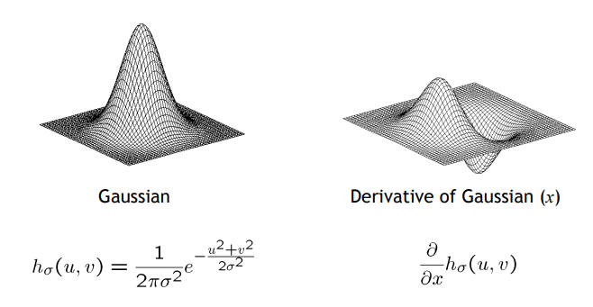

참고 : [Reading: Szeliski Chapter 3.2, page 111](https://szeliski.org/Book/)

# 서론

---

컴퓨터 비전의 두 가지 고민거리

`Denoising` 과 `Edge detection` 이다.

# Image Denoising

---

실제로는 하고자 하는건 위 사진 같은 저화질, 저조도 이미지의 노이즈를 제거하는 것이다.

Center pixel을 그 주변의 Neighborhood의 weighted average로 새로 적용을 해보자.

나중에 weight를 주는 다른 방법들이 나온다.

첫번째 방법은 `weighted sum` 으로 픽셀을 대체하는 것이다. 

이때의 `weight`를 `filter kernel` 이라고 한다.

이미지는 배열로 픽셀 색상을 저장하는데

작은 `local window`를 움직이며 `weighted average`를 내는 것

이것을 `moving average` 라고 한다.

동일한 필터 커널을 슬라이딩하며 픽셀을 다 대체한다. 

이를 통해 Output에서 어느 정도 부드러워진 것을 볼 수 있다.

하지만 커널 너비에 따라 output 사이즈가 줄어들어. 가장자리가 줄어드는 것이다.

이걸 보존하고 싶으면 어떻게 할까.

아래는 가장자리가 얇은(일반적인) 경우

위는 가장자리가 얇은(일반적인) 경우인데 회색 박스를 Multiplication 해주는 모습이다.

아니면 커널 길이 / 2 만큼을 0으로 채워 가중치를 구하는 방법도 있다.

여러가지 채우는 방식

위처럼 여러가지 채우는 방식이 있다.

특징적인 필터 커널 예제들을 아래에서 살펴보자.

1. Impulse

Impulse는 원본에 아무 영향을 주지 않는다.

1. Translated Impulse

shift할 수 있다. 위 경우는 모든 픽셀이 다 자신의 오른쪽 픽셀로 대체된다. 즉, 왼쪽으로 shift한 output이 되는 것이다.

1. Box filter

denoising 보다는 smoothing

각 픽셀의 intensity를 1/9로 축소한다. 그럼 `blur` 효과를 얻을 수 있다.

1. Sharpening filter

`sharpening`은 주변 픽셀과의 차이를 극대화시켜 경계 부분의 명암 비를 증가시켜 준다.

위 연산은 intensity를 2배로 늘려서 blur 처리한 이미지를 빼줘

이렇게 함으로써 격차를 더 강조하여 선명한 이미지를 얻을 수 있다.

아래 예로 더 차이를 확인할 수 있다.

sharpening을 통해 원본보다 선명해진 모습.

# Edge detection

---

Image filtering은 스무딩에 가깝고, Edge detection은 실제 유의미한 차이를 찾아야 한다.

그래서 Edge detection은 경계를 어떻게 설정할지에 대한 고민이 필요하다.

일단 Grayscale을 적용해 시각화를 해준다.

z 축은 gray intense로 숫자가 클 수록 까만 것이다.  눈은 하얗고(0), 털 색은 까맣다(1)

영상을 $I(x, y)$로 표현했을 때 x, y로의 pixel gradient를 계산하자.

이 계산으로 x, y축 각각의 gradient를 알 수 있다.

gradient를 square sum 하면 edge를 구할 수 있다.

위 예시에서는 검정과 흰색의 비교였었기 때문에 개의 edge는 더 찾기 쉬웠다.

이제는 neighborhood filtering에 대해 알아보자

x축의 차를 구하기 위해 현재 pixel에서 전 pixel을 구하기 위해 $d_x$의 matrix가 왼쪽처럼 나온다. 

$d_y$도 마찬가지이다. 슬라이딩 윈도우를 생각하면 이해가 쉽다.

결국 최종 목표는 좋은 `denoiser` 를 만들어 랜덤한 노이즈가 껴도 원본을 찾을 수 있도록 하는 것이다.

# Filtering

---

앞에 다룬 내용을 수학적으로 정리하자

일반화 과정을 이해만 하자 100프로 알기 보다는

원본 f[n, m]을 커널 H 에 통과시켜 g[n, m]으로 필터링한다는 의미이다.

### Linear filtering

---

linear : 참고자료를 참고하자

g가 input, f가 output이다. 이때 filter 커널 h는 2x2 사이즈 이다. 

h[n, m, k, l] 필터가 원본 사이즈만한 경우이다.

**Linear transformation**

output [n, m]을 추론하기 위해 원본 데이터 [k, l]을 바꾸며 계산한다.

전의 filter kernel의 local window는 고정된 값을 슬라이딩시킬 뿐이였다.

하지만 지금은 현재 pixel [n, m]에 따라 필터의 크기, 값이 계속 바뀐다. 이때 사이즈는 원본 데이터에 의존한다.

하나의 output pixel을 도출하기 위해 원본 데이터의 모든 정보를 취합해 새로운 커널을 도출해낸다.

즉, 다음 output pixel을 구하려면 또 새로운 커널을 생성해야 한다는 것이다.

정리하자면, 값이 고정된 local window가 아닌 매 pixel마다 바뀌는 커널을 쓰는 일반화된 과정.

입력이 shift 된 것이나 입력 고정 후 출력을 shift 한 것의 결과는 동일하다

⇒ translation invariance. 필터링 출력 결과는 고정된 local window에 따라 결정되니까.

### Cross-correlation

---

위와 같은 operator를 cross-correlation이라 한다.

이미지 f [k, l]을 (m, n) 만큼 shift 하고, f의 모든 데이터에 커널을 씌워 연산한다.

h와 shifted f는 dot 연산한다.

Linear filtering과는 커널의 연산 과정에서 차이가 있다.

### **Convolution**

---

합성곱(convolution)은 작은 커널을  flipping해서 곱하고 더한다.

flipping은 커널의 좌표계를 원점 기준 뒤집은 상태로 더한다. 즉, h를 h[-k]로 사용한다는 것이다.

위와는 flipping해서 곱한다는 차이가 있다.

만약 필터가 대칭이면 cross-correlation과 동일한 결과를 얻었을 것이다.

[Convolution 관련 영상](https://youtu.be/4uvDVEQkzXQ?si=tR7eC7ezyHZQCwMF)이다. filtering 과정이 그저 matrix의 multiplication 과정임을 보여준다.

convolution 방식을 쓰면 연산 속도를 최적화를 좀 더 할 수 있다.

교환, 결합, 분배 법칙 적용이 된다.

### Rectangular filters

---

x축 커널로 convolution하여 필터링 하면 위처럼 된다.

y축 커널로 convolution하여 필터링 하면 위처럼 된다.

x, y축이 아닌, 카메라 궤적처럼 자연스러운 커널을 사용하면 위처럼 된다.

이걸 역연산을 하면, convolution weight를 예측을 해서 흔들림을 제거할 수도 있겠다

지금까지는 linear transformation, convolution, box 필터를 썼고, 다음 시간은 가우시안 필터를 쓰겠다.

# Gaussian kernel

---

초록색 박스는 전체 확률을 더하면 1이 되도록 normalization 시킨 것.

분산이 작을 수록 좀 더 중앙 집중적이게 weight를 높게 주는 모습

box filtering에 비해 gaussian filtering이 edge를 더 살린다는 것을 알 수 있다.

gaussian filtering에서 분산이 작을 수록 더 가까운 것에 weight를 더 둔다는 뜻이다.

따라서 분산이 작을 수록 blur가 약해지는 것을 알 수 있다

gaussian kernel은 분리가능하다.

x축으로 필터링 후 y축으로 필터링 하면 그냥 gaussian filtering 한 것과 같은 결과를 얻는다.

훨씬 빠른 속도로 연산이 가능한 것이다.

[convolution 영상 예시 2](https://youtu.be/KuXjwB4LzSA?si=i3HT_Qvb1syDyAgK) : 8분쯤부터 보면 됨. 첨부터 다 봐

위 영상을 보면 나오는 내용인데, gauassian filtering은 커널 안의 숫자의 합이 1이 되게 만들었었는데, 여기서는 합이 0이 되게 설정한다. 이렇게 하면 경계선을 알 수 있는 한 가지 방법이 되겠다.

derivative filter는 정확한 경계선을 찾기 힘들다.

변화율이 너무 튀기 때문에 미분을 한다해도 정확한 edge를 찾기 쉽지 않다.

그 때문에 이를 Smoothing 해주어야 한다.

위처럼 h를 곱해 원본을 smoothing한 뒤 미분을 하면 좀 더 정확한 edge를 찾을 수 있을 것이다.

gauassian kernel과 derivative of gaussian kernel의 차이를 보자.

gaussian scale은 분산이 커질 수록, 더 블러가 심해지는 것을 볼 수 있다.

반면 derivative of of gaussian scale은 gaussian의 결과와는 차이를 보인다.

근데 사실 guassian filter 만 사용하는 건 너무 옛날 방식. 별 효과 없어

# Blurring

---

guassian filter는 edge 인식을 못하고 그저 blur만 할 뿐이야.

## Median filtering

---

- 현재 pixel, p
- p 주변의 neighbor pixels, n
- n 중 하나인 pixel, q

neighborhood의 pixel들을 median 시켜 filtering된 결과를 얻는다.

neighborhood의 사이즈에 따라 위와 같은 블러의 결과가 나온다.

Bilateral Filtering for Gray and Color Images 논문을 이해를 해보자 → 강의 자료에 있음.

→ 공부를 해봐라. 아래 내용을 한 번 보고 논문으로도 확인을 해보자

median filtering은 $I$ 영상에 n(neighborhood)에 포함된 q 픽셀 입력.

이때 n 정의는 p에서 온다. 

p에 local window 설정하고 weighted sum을 진행. 이때 weighted sum이 G이다. 

weight는 p와 q 사이의 거리로 설정한다. 즉 guassian function을 사용해 가까울 수록  weight를 높게 준다.

## Bilateral filtering

---

edge에는 weight를 적게 줘야 한다. 만약 p와 q가 서로 다른 영역이면 weight를 적게 줘야 edge 판명을 더 잘할 수 있다.

이 판단 기준을 p와 q intensity의 차이로 하여, 차이가 작으면 blurring을 세게 주고, 차이가 크면 edge일 확률이 크니 blurring을 약하게 준다. 

edge를 단순 픽셀 intensity로 두는 간단한 방법이다.

gaussian filter에서 weight term을 하나 더 준 것이라 생각하면 된다.

p와 q의 intensity의 차이로 한 것이 `range gaussian`이다.(초록색 박스)

거리가  가까울 수록 weight를 크게 주는 것이 `spatial gaussian` 이다.

range 조건을 추가해서 같은 영역인지 조건을 추가한 것이다.

예를 들면, 위 흑백 사진에서 흰색과 검은색의 차이가 날 수록, 즉 다른 영역일 수록 그리고 거리가 멀 수록 weight가 작아진다.

이렇게 weight를 여러 조건으로 필터링을 진행을 하면 좀 더 낫다

noise가 많은 input에서 edge를 찾으면서 위쪽 noise만 제거를 하는거야

다시 말하지만 spatial은 거리, range는 intensity 차이이다.

가까울 수록 크게, intensity 차이가 작을 수록 크게 weight를 설정한다.

spatial과 range의 분산을 다르게 했을 때의 filtering 결과들이다.

결국 bilateral filtering이 좀 더 낫다.

필터링을 여러 번하면 이렇게도 할 수 있다.

그럼 특정 이미지를 찾을 수도 있을까?

필터를 눈 모양으로 해서 유사한 이미지일 수록 weight를 높게 줄 수 있을까 라는거.

눈 필터를 바로 적용하면 원하는 기댓값이 안 나오는 걸 확인할 수 있다.

위 수식은 그저 더하는 거라 의미 없음

구조적으로 비슷한 걸 보고 싶은 것. 눈 필터의 밝기 차이 정도가 밝기 값보다는 의미가 있지 않을까에서 나온 위의 filtering. 흰자는 수치가 높을거고, 동공은 낮겠지.

하지만 이 절대적 수치보다는 상대적인 차이로 구조를 알고자 하는거지

이를 위해 커널에서 픽셀 intensity의 mean을 구해서(바 f) 이를 빼서 연산을 한다.

커널 템플릿에서 평균을 빼서, 낮은 건 - 높은 건 + 같으면 0이겠지. 만약 정확히 일치를 한다면 최댓값을 가지게 되는거지 → 내적 결과를 냈을 때 동일하면 제일 큰 값이 나오니까.

threshold는 특정 수치 이상이면 표시하겠다 라는거. 결국 가장 높은 값만 출력하는 것이다.

하지만 false detections가 있는 모습

Method 2에서 g에도 template의 mean을 빼서 연산한다.

결국 평균을 뺀 벡터와 평균을 뺀 벡터를 내적하고 이를 normalization 한다. 1일 수록 일치하고 -1일 수록 다르다는 뜻을 가지겠지

이제는 정확히 두 눈만 찾는 것을 볼 수 있다.

하지만 바라는건 thresholded 인데 normalized x correlation 에서 바로 깔끔하게 나오지는 않는다.

특정한 것을 인식하고 싶을 때 완전 동일한 것이 아니면 찾기가 힘들다.

의자라는 template를 찾고 있는데 이런 template 기반 filtering(현재는 밝기 차이만 쓰는 낮은 수준의 picture)에서는 동일한 이미지를 찾기는 쉽지 않다.

# 결론

---

이렇게 컴퓨터 비전에서 중요한 고민거리 2가지와 이를 위한 여러 Filtering 방법들을 살펴보았다.

다음에 시간을 내서 관련 논문을 읽어보도록 하자.