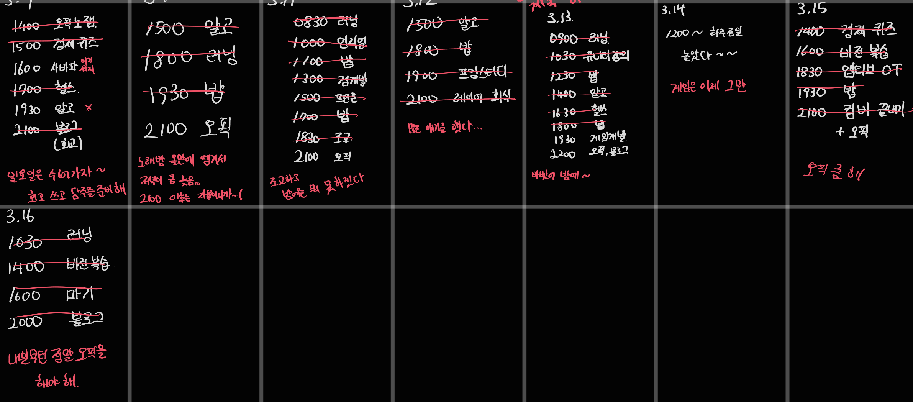

## 25년 3월 2주차를 돌아보며

---

2주차째 하고 있는데 이게 하루 시작 전에 계획을 쓰는게 잘 안 지켜지는 느낌. 다음주는 매일 아침에 계획을 세우는 루틴을 만들어보자.

### TODO

**마기 : 전당포 보스 완성**

-> 완성을… 못했고 애니메이션과 Trigger, Catch를 구현해야 한다.

### KEEP

- **헬스 루틴대로 진행(최소 4회 이상)**
- **7시 기상**
- **평화롭게 살자 스트레스 없이 누군가는 해야 해**

: 헬스는 일단 계속 잘 진행하고 있다.

7시 기상도 항상 하는 중. 일요일에 잠을 한 번 보충해주는게 중요하다.

평화롭지는 못했는데 지금은 행복하다. 굿!

### QUESTION

**계획은 잘 지켜졌는가? 안 지켜졌다면 왜인가?**

: 이게 약속이 생기면 짧은 시간들이 주어지는데 이때 집중을 잘 못하는 것 같다. 

담주에는 자투리 시간을 잘 써보자

## 25년 3월 3주차를 바라보며

---

### TODO

- 마기 : 전당포 보스 완성 + 전당포 출구

### KEEP

- 헬스 루틴대로 진행(최소 4회 이상)
- 7시 기상
- 평화롭게 살자 스트레스 없이 누군가는 해야 해
- 매일 아침 하루의 일정을 쓰자

### QUESTION

새로운 사람들과는 잘 어울릴 것 같은가?