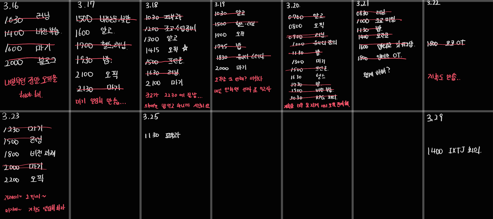

# 25년 3월 3주차를 돌아보며

---

일단 계획 쓴 것도 잘 안 지켜지고, 특히 오픽이 잘 안 지켜진다. 

일단 이번 주는 동아리 2개 들어간 역풍이 불었다. 오티에 새로운 팀 회의에 기존 팀 활동까지 더해지니까 뭔가 바쁜 한 주 였다. 첫 주라 좀 정신없고 하겠지. 점차 적응시키고 계획에 반영해서 다음 주는 또 잘 지켜보자.

중요도를 정해야 할 것 같다. 지금은 유니티 강의도 끼워넣고 뭐도 하고 있는데, 쳐낼 건 쳐내고 할 걸 해야겠어.

마기 >>> 앱티브, 코코 > 전공 > 오픽, 헬스, 알고

마기 완성이 무엇보다 중요하고, 그 다음 동아리인데, 뭐 빡세지 않고 주에 한 번 정도 시간을 쓰는거니 오케이.

전공 공부랄게 정보 보안, 컴퓨터 비전 뿐인데 좀 잘 해보자. 과제도 하고…

 

알고리즘은 꾸준히 문제를 풀도록 하고, 오픽, 헬스가 잘 안 지켜지는데 우선순위가 제일 낮기 때문인 것 같아.

위에서 솔직히 안 중요한 건 없고 다 잘 해내야 해. 힘내보자

### TODO

- 마기 : 전당포 보스 완성 + 전당포 출구

: 일단 실패이고, 전당포 보스가 생각보다 오래 걸리기도 하고 영환이랑 협업을 해야 하니 작업이 더뎌. 일단 출구를 먼저 만지고 있는게 맞을 듯 하다.

### KEEP

- 헬스 루틴대로 진행(최소 4회 이상)
- 7시 기상
- 평화롭게 살자 스트레스 없이 누군가는 해야 해
- 매일 아침 하루의 일정을 쓰자

: 헬스는 3번 정도 한 것 같고, 저녁 약속이 있으니 할 타이밍이 쉽지 않다.

7시 기상은 뭐 한결 같고(벌써 5주차인게 놀랍다)

딱히 스트레스는 없었다. 행복해 그냥

일정 쓰기 이거 좀 만 더 철저히 지켜보자. 지금은 바로 쓰지는 않는 듯 

### QUESTION

Q. 새로운 사람들과는 잘 어울릴 것 같은가?

A. 앱티브 사람들이랑은 다 잘 맞을 것 같아. 사람들이 좋고 게임 개발을 같이 한다는 소속감이 너무 좋아.

코코는 신입생들이 많아서 좀 어려웠기 한데, 그래도 뭐 열심히 해봐야지.

# 25년 3월 3주차를 바라보며

---

### TODO

- 마기 보스를 반드시 완성해
- 과제를 제때 쳐내보자

### KEEP

- 헬스 4번 이상
- 7시 기상

### QUESTION

이번 주는 계획을 잘 지키는 멋진 어른이 됐니?