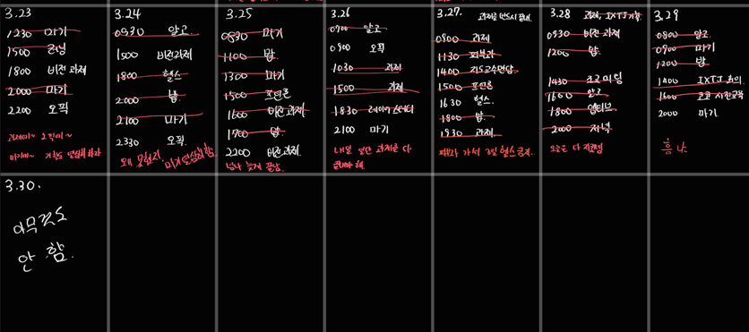

# 25년 3월 4주차를 돌아보며

컴퓨터 비전 과제한다고 시간을 많이 날렸다.(사실 날렸다고 하기엔 해야 하는 일이야..). 오픽은 여전히 못하고, 아니 안 하고 있다. 간절함이 부족한 탓이다. 반드시 해.

1, 2교시를 활용하고자 하니 오전 시간이 많이 생기게 됐다. 이때 생각 없이 할 수 있는 일들, 과제나 알고 문제를 풀자.

마기 개발을 열심히 하자. 시간이 촉박하니 다음주 계획인 튜토리얼 완성에 집중해서 작업하자. 그리고 목요일까지 돈크로스더라인(줄여서 뭐라 할까. 돈크라) 프로토타입 완성을 해보자. UI만 건들면 되니 어렵지 않을 것이다.

뭔가 할게 많아지니까 혼자 초조해지고 불안해지는 한 주였다. 그런데 중요한 걸 다시 생각하자. 내 일들을 쳐내는 것도 중요하나 가족과의 시간도 보내고, 사람들과 보내는 시간들도 중요한 것 같다. 그니까 초조해하지 말고 그냥 열심히 살다보면 나중에 지금을 돌아보았을 때 후회 없지 않을까 싶다.

### TODO

- 마기 보스를 반드시 완성해
- 과제를 제때 쳐내보자

### KEEP

- 헬스 4번 이상
- 7시 기상

7시 기상은 항상 클리어. 클리어 못할 수가 없어~

헬스를 많이 못했는데 피부과 이슈도 있었고 과제 이슈도 있었고,, 할게 많아서 헬스를 뒤로 미룰 수 밖에 없었어.

### QUESTION

**이번 주는 계획을 잘 지키는 멋진 어른이 됐니?**

나름 잘 지킨 것 같기도… 오픽을 진짜 반드시 하자. 헬스도 틈틈히 하자.

게임 개발도 열심히.. 그냥 다 열심히 해~~

# 25년 4월 1주차를 바라보며

---

### TODO

- 마기 튜토리얼 제작
- 돈크라 프로토타입 제작

### KEEP

- 오픽 꼭 최소 일주일 4번 이상 하자
- 헬스, 러닝을 꼭꼭 하자.

### QUESTION

**게임 개발은 너가 게을리 하면 안 돼. 이것도 안 하면 뭘 할래. 열심히 했지?**