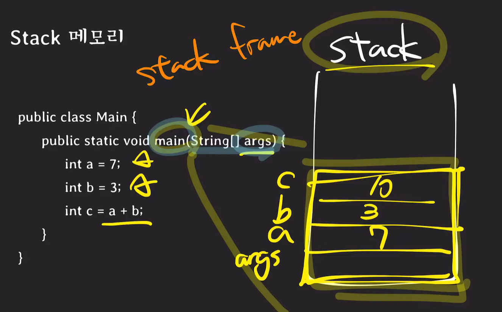
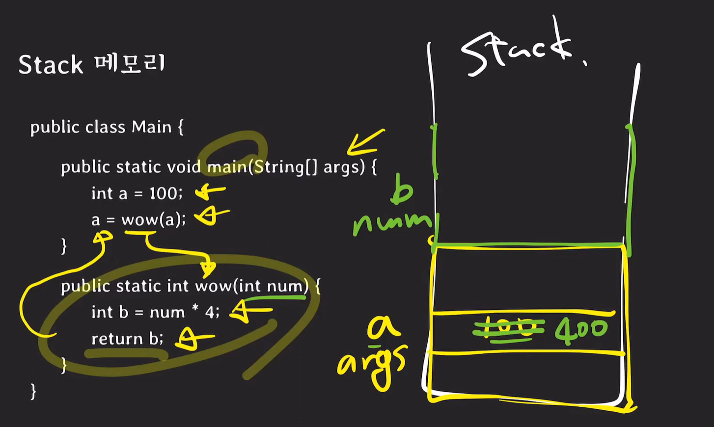
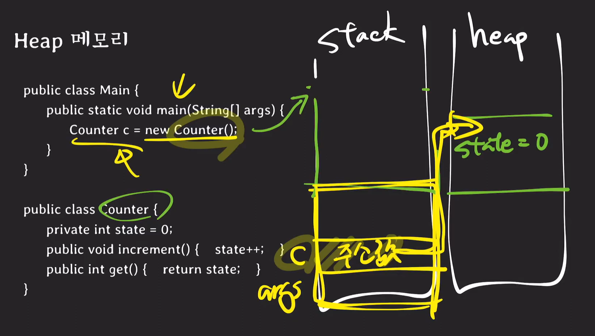
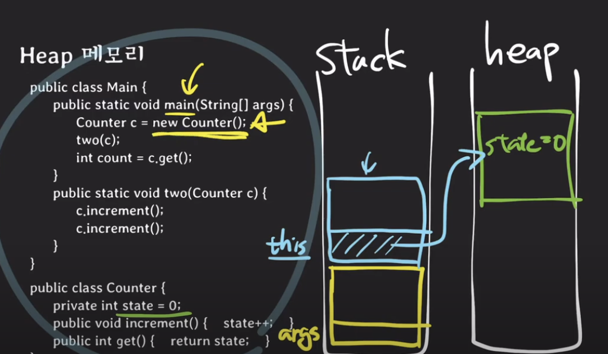
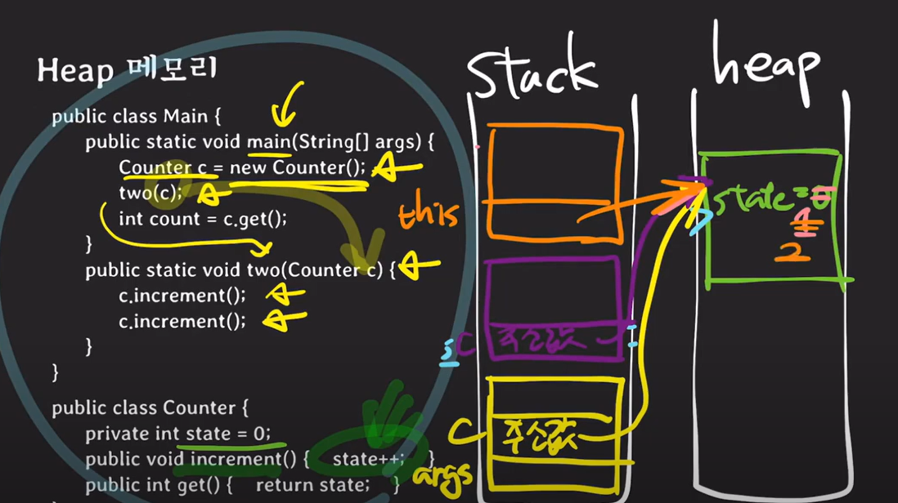
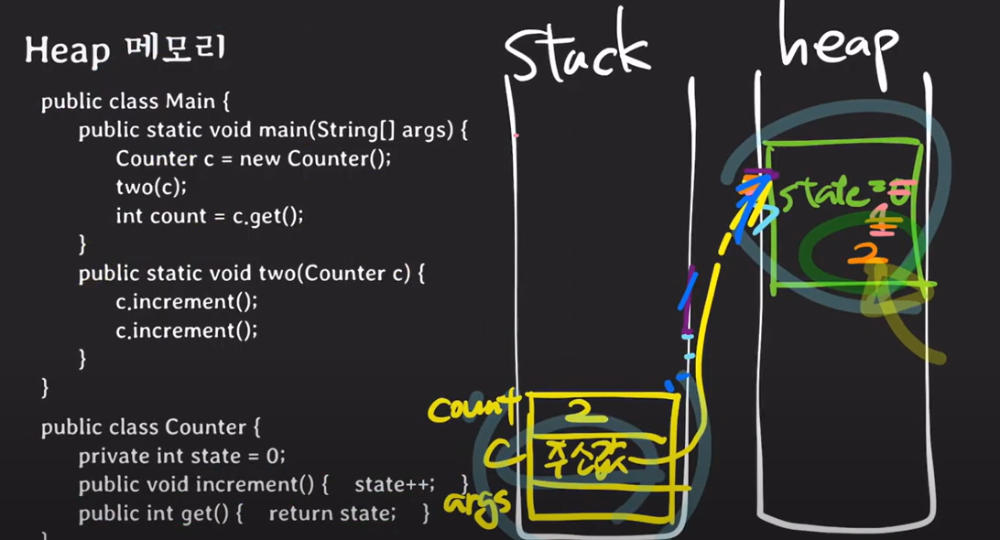
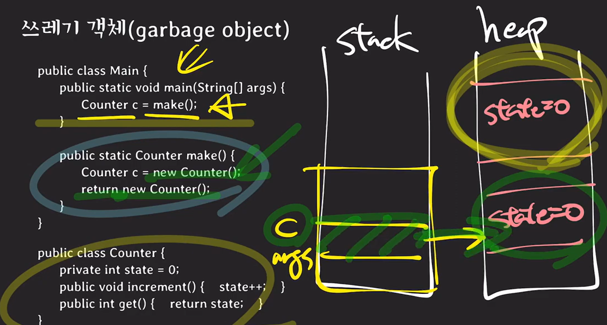

쉬운코딩 BJ.4 참고(https://youtu.be/GIsr_r8XztQ?si=HolgwBDrJTMyCKmX)

### 어플리케이션은 어떻게 실행되는가.

```c
// CPU, Memory
int a = 7;
int b = 3;
int c = a + b;
```

- 메모리 상에 7이 저장, a라는 이름 붙인다.
- 메모리 상에 3이 올라가고 b라는 이름 붙인다.
- CPU에 a, b를 들고와서 연산하여 메모리에 연산 결과 10을 올리고 c 이름 붙인다.

### 메모리 구조


- 메모리는 내부적으로 여러 영역으로 나뉜다.
- Stack : 함수, 메서드, 지역 변수(주소), 매개 변수(주소), return address(런타임에 크기 결정)
- Heap : 동적 할당 영역, 배열, 객체 등 저장

**Stack: 함수, 메서드, 로컬, 매개 변수 등 저장 !** 

예제 1



```c
public class Main {
		public static void main(String[] args) {
				int a = 7;
				int b = 3;
				int c = a + b;
		}
}
```

- main method 실행 시 stack memory에 스택 프레임이 생긴다.
- args 라는 매개변수 공간이 stack 에 잡힌다.
- 7, 3이 stack에 저장되고 a, b 이름을 붙인다.
- 최종 결과인 10인 stack에 저장되고 c 이름을 붙인다.

예제 2



```c
public class Main {
		public static void main(String[] args) {
				int a = 100;
				a = wow(a);
		}
		
		public static int wow(int num) {
				int b = num * 4;
				return b;
		}
}
```

- main method 실행 시 stack memory에 스택 프레임이 생긴다.
- main 프레임에 100을 저장하고 a 이름을 붙인다.
- wow method 실행을 위해 wow 프레임을 만든다.
- wow 프레임에는 num 이라는 매개변수를 저장한다.
- b 연산 결과인 400을 wow 프레임에 저장한다.
- b 값을 return 하면 wow method가 끝나므로 wow 프레임을 없애준다.
- 그리고 a 메모리에 저장된 100을 지우고 400을 저장한다.
- 자동으로 stack이 생기고 사라진다. 다만 함수가 무한 재귀가 될 시 stack memory 공간이 없어져 앱이 죽게 된다.

**Heap : 객체가 저장된다!!**

예제1



```c
public class Main {
		public static void main(String[] args) { // param variable args
				Counter c = new Counter(); // local variable c
		}
}

public class Counter {
		private int state = 0; // instance variable
		public void increment() { state++; } // method 1
		public int get() { return state; } // method 2
}
```

- 위에는 instance, parameter, local Variable, 총 3개의 변수가 존재한다 !
- Stack에 main method 프레임 생성, args 저장
- Counter Constructor도 method 이므로 해당 스택 프레임 생성
- Heap에는 Counter Instance의 정보를 저장한다. (state = 0)
- Counter Constructor 처리가 끝나면 Stack의 프레임 제거
- Stack의 c 공간에 Heap에 저장된 Counter Instance의 메모리 주소를 저장한다.

예제 2 

```c
public class Main {
		public static void main(String[] args) { // param variable args
				Counter c = new Counter(); // local variable c
				two(c);
				int count = c.get();
		}
		public static void two(Counter c) {
				c.increment();
				c.increment();
		}
}

public class Counter {
		private int state = 0; // instance variable
		public void increment() { state++; } // method 1
		public int get() { return state; } // method 2
}
```

- Counter instance의 method를 호출하는데, Heap에 Counter instacne를 저장하고, stack frame의 two method의 인자에 counter instance를 넣고, counter instance의 method를 실행시킨다.
- Stack memory에 main frame 생성, args 저장
- Stack memory에 Counter constructor frame 생성, this variable 저장
    
    
    
- Heap memory에 Counter instance 생성, state variable 저장
- this가 Heap instance를 가리킨다. 생성자(this에 대한 스택 메모리)는 동작 후 사라진다.
- main frame에 c를 저장하는데 이게 memory address 이다.(local variable c와 인자로 전달된 c는 같은 heap 주소를 가진다.)
- two method에 대한 frame 생성, c variable 생성, 이 c는 위의 memory address 이다.
- c의 increment method를 stack frame에 생성하고, this 변수가 memory address를 가리키겠지. (this가 생기는 이유는 instance 안의 method 호출이기 때문에 stack에 increment()에 대한 this가 생긴다.)
- 이 increment method로 state에 1을 저장하고 사라진다.
- 그 후 한 번 더 method를 실행시키니 똑같이 this + 함수 동작이 생성되고  state++; 후에 다시 사라진다.
- 결과적으로 state에 2가 저장되겠다.
    
    
    
- 이제 two는 끝났으니 two에 준 stack frame을 제거한다.
- 그 후 c instance의 get method를 실행시키기 위해 stack frame을 생성하고 이떄도 this라는 변수가 생기며, heap의 instance를 가리킨다.
- 현재 state = 2 이니 이를 반환하면서 get method가 종료되고, 다시 stack memory에서 사라진다.
- 최종적으로 stack에는 main mehod만 남게 되고, count = 2가 저장이 된다.



- 이처럼 객체의 변수는 모두 객체를 가리키긴다. main method의 c와 parameter로 넘긴 c가 모두 동일한 객체를 가리키는 것이다.
- **객체는 Heap 메모리에 저장되기 때문이다 !!**

### Garbage object

```c
public class Main {
		public static void main(String[] args) { // param variable args
				Counter c = make();
		}
		public static Counter make() {
				Counter c = new Counter();
				return new Counter();
		}
}

public class Counter {
		private int state = 0; // instance variable
		public void increment() { state++; } // method 1
		public int get() { return state; } // method 2
}
```

- main method의 Counter instance와 make method로 생성한 Counter instance는 각각 존재하게 된다.
    
    
    
- make method에서 생성한 instance는 누구도 참조하고 있지 않는다. 이게 Garbage object 이다.
- 아무도 접근할 수 없는 Counter() 객체는 Garbage 가 된다.
- main method의 instance는 계속 참조한다.
- 이런 Garbage object를 수집하는 GC(Garbage Collector)가 성능을 좌지우지 한다.

### Python 예제

파이썬은 모든 변수가 객체이다.

```python
def wow(num);
		print(num);
		
a = 1
wow(a)
```

- a = 1 부터 실행한다. 함수는 정의일 뿐이니까.
- 숫자 1에 대한 객체가 heap 영역에 만들어지고 stack에는 1을 가리키는 주소를 저장
- wow method 실행하면 stack frame이 쌓이고, num paremeter를 저장한다. 이때 값을 저장하는게 아닌 heap에 있는 a의 address를 저장한다.