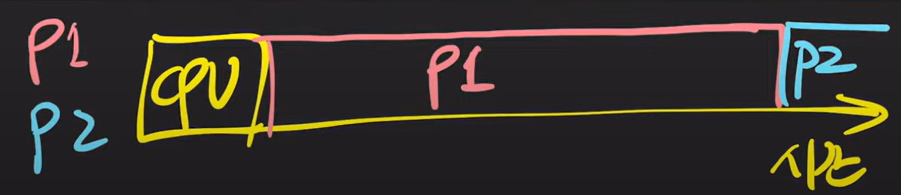
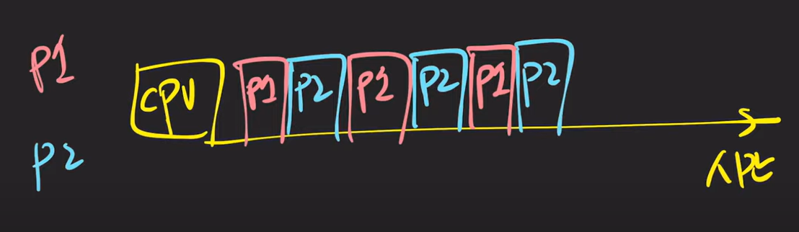
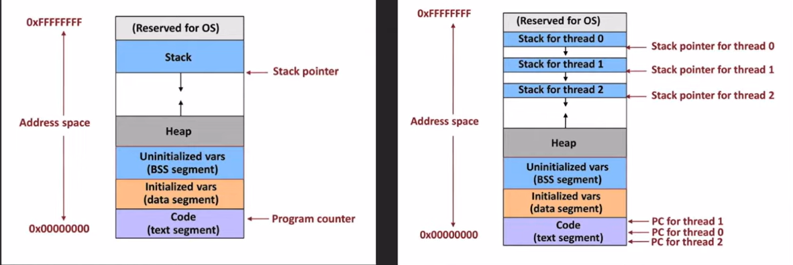
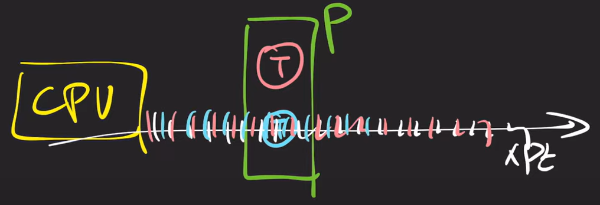

쉬운코드(https://youtu.be/QmtYKZC0lMU?si=pSrwXtX6GYK79WuS)

### 기본 개념

**프로그램** : 컴퓨터가 실행할 수 있는 명령어 집합

**프로세스** : 컴퓨터에서 실행 중인 **프로그램**

- 각각의 프로세스는 독립된 메모리 공간 할당(명령어, 데이터 가짐)

**CPU** : 명령어 실행 연산 장치

**메모리** : 프로세스가 CPU에서 실행되기 위해 대기하는 곳

**IO** : 파일 읽고 쓰기. 네트워크의 어딘가 또는 입출력 장치와 데이터를 주고 받는 것

### 단일 프로세스 시스템

초창기 컴퓨터는 한 번에 하나의 프로그램만 실행했다. 

하지만 이런 단일 프로세스 시스템은 CPU 사용률이 좋지 않다. 

그 이유를 예를 들어 보자면,

- 어떤 프로그램 `P1` 을 실행시키면 CPU에서 `P1`을 실행한다.
- `P1`에 `I/O` 작업이 들어오면 CPU 작업을 멈추고 `I/O` 작업을 한다.
- `I/O` 작업 끝나면 다시 CPU에서 `P1`이 실행.

이처럼 CPU가 일을 하다가 쉬는 시간이 발생해서 효율이 안 좋다.

이를 해결하기 위해 **여러 개의 프로그램**을 메모리에 올려놓고 동시에 실행시킨다.

IO 작업이 발생하면 다른 프로세스가 CPU에서 실행이 된다.

예를 들자면,

- `P1`, `P2` 프로그램이 있고 CPU에서 실행이 된다.
- `P1`이 CPU에서 실행되다가 `IO` 작업을 하러 간다.
- 그럼 CPU에서 이어서 `P2`를 진행한다.
- `P2`도 `IO` 작업이 있다면 CPU가 쉬게 될 것이다.
- `P1`, `P2` 중 `IO` 작업이 끝난 프로그램이 이어서 CPU에서 실행된다.

위 과정이 바로 **멀티프로그래밍** 이다.

### 멀티프로그래밍

앞서 설명한 개념이 **멀티프로그래밍** 이다.

**CPU 사용량을 극대화** 하기 위해 도입된 개념이다.

하지만 CPU 사용 시간이 길어지면 다른 프로세스는 계속 대기하게 된다.

위에서 P1이 CPU를 먹고 있으니 P2가 실행되지 못한다.(Starvation 발생)

이를 해결하기 위해 프로세스는 CPU를 사용할 때 아주 짧은 시간(=quantum)만 CPU에서 실행되게 한다.

예를 들자면,

- P1, P2 프로그램이 있다. 아주 짧은 시간, quantum(ms 단위)으로 시간을 쪼갠다.
    
    
    
- 이 시간만큼 프로그램을 번갈아 실행한다.

### 멀티태스킹

위와 같은 시스템을 **멀티태스킹**이라고 한다. 멀티프로그래밍 개념에서 CPU 실행 시간을 쪼갰다는 차이가 있다.

프로세스의 **응답 시간을 최소화** 시키는데 목적이 있다. 

→ 여러 프로그램이 거의 동시에 실행되는 것 처럼 보인다.

여러 프로세스가 동시에 실행되는 것은 가능하다.

하지만 여전히 아쉬운 점

- 하나의 프로세스가 동시에 여러 작업을 수행하지는 못한다. 여러 프로세스를 만들면 되겠지만…
- 프로세스의 **컨텍스트 스위칭**은 overhead가 크다.
- 프로세스 간 **데이터 공유**가 까다롭다. 프로세스는 독립적인 메모리 공간을 가지기 때문
- CPU에 2개의 코어를 둬서 전체적인 성능을 향상시키는  듀얼 코어가 등장

### 스레드

- 프로세스는 한 개 이상의 스레드를 가질 수 있다
- CPU에서 실행되는 단위(unit of execution), 프로세스는 최소 1개 스레드를 가진다
- 같은 프로세스의 스레드들 간의 **컨텍스트 스위칭은 가볍다**
- 스레드는 자신이 속한 프로세스의 **메모리 영역을 공유**

왼쪽은 스레드 이전 메모리 구조, 오른쪽은 멀티 스레드 일 때의 메모리 구조이다.

스레드들은 프로세스의 **Heap 영역 데이터**를 공유한다. 같은 프로세스 영역에 있어도 스레드 별 고유 영역인 Stack 데이터는 공유하지 않는다.

예를 들자면,

- CPU의 실행시간을 quantum으로 쪼개 Thread가 번갈아가며 멀티태스킹 처럼 동작한다.
    
    
    
- 그런데 만약 코어가 2개인 CPU 라면 Thread가 2개라면 각 코어 당 하나의 Thread를 실행시키면 된다. 진정한 의미의 동시 실행이라고 볼 수 있다.

### 멀티스레딩

위와 같은 방식을 **멀티 스레딩** 방식이라고 한다.

**하나의 프로세스가 동시에 여러 작업을 실행**하는데 목적을 둔다.

멀티스레딩의 등장으로 멀티태스킹의 개념이 **여러 프로세스와 여러 스레드**가 quantum으로 쪼개진 CPU Time을 나눠 같은 것으로 확장되었다.

### 멀티프로세싱

두 개 이상의 프로세서나 코어를 활용하는 시스템을 말한다. 

### 마무리

지금까지 배운 개념을 정리해보자.

1. 싱글코어 CPU에 싱글-스레드 프로세스 두 개 있다면?

| 멀티태스킹 | o |
| --- | --- |
| 멀티스레딩 | x |
| 멀티프로세싱 | x |

하나의 CPU를 나눠 쓰니까 멀티 태스킹이다.

단일 스레드 이니 멀티 스레딩 아니다.

싱글 코어 이니 멀티 프로세싱은 아니다.

1. 싱글코어 CPU에 듀얼-스레드 프로세스 한 개

| 멀티태스킹 | o |
| --- | --- |
| 멀티스레딩 | o |
| 멀티프로세싱 | x |

하나의 CPU를 나눠 쓰니까 멀티 태스킹이다.

스레딩 2개 이상이니 멀티 스레딩 맞다.

싱글 코어 이니 멀티 프로세싱은 아니다.

1. 듀얼코어 CPU에 싱글-스레드 프로세스 2개

| 멀티태스킹 | x |
| --- | --- |
| 멀티스레딩 | x |
| 멀티프로세싱 | o |

코어 하나 당 프로세스 하나 돌리면 되니 멀티태스킹 아니다.

단일 스레드이니 멀티스레딩 아니다.

코어가 2개이니 멀티프로세싱 맞다.

1. 듀얼코어 CPU에 듀얼-스레드 프로세스 한 개

| 멀티태스킹 | x |
| --- | --- |
| 멀티스레딩 | o |
| 멀티프로세싱 | o |

코어 하나 당 스레드 하나 돌리면 되니 멀티태스킹 아니다.

듀얼-스레드 이니 멀터스레딩 맞다.

코어가 2개이니 멀티프로세싱 맞다.

1. 듀얼코어 CPU에 듀얼-스레드 프로세스 두 개

| 멀티태스킹 | o |
| --- | --- |
| 멀티스레딩 | o |
| 멀티프로세싱 | o |

코어 당 프로세스 하나를 돌리는데 프로세스에 스레드가 2개이니 멀티태스킹 맞다.

듀얼-스레드이니 멀티스레딩 맞다.

듀얼코어니 멀티프로세싱 맞다.