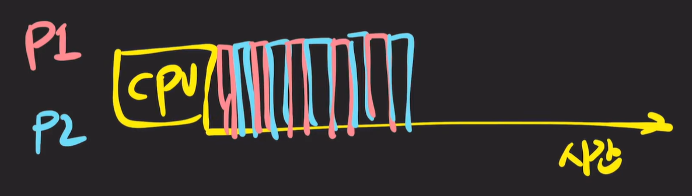
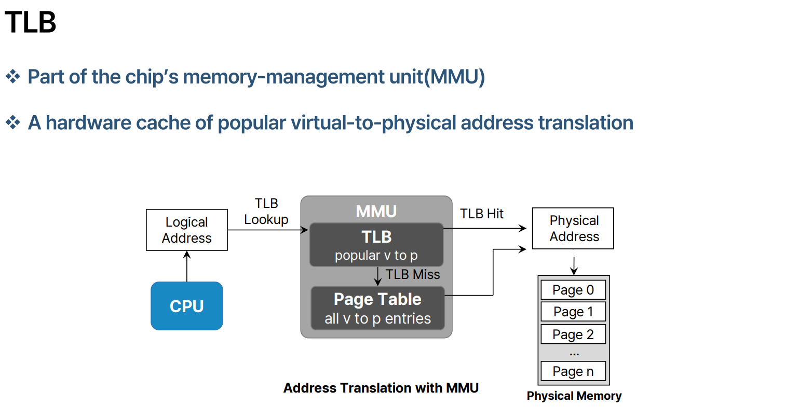
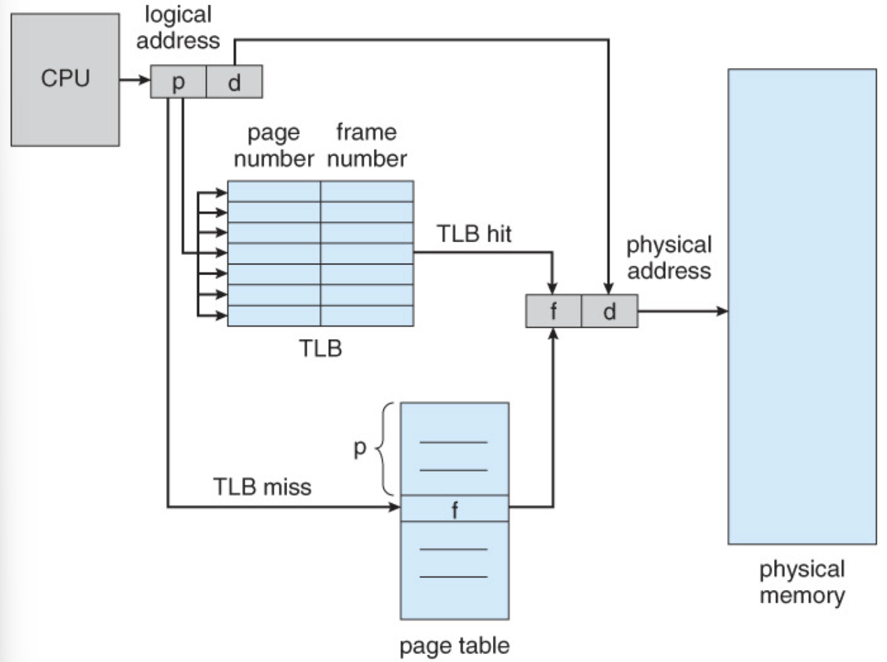
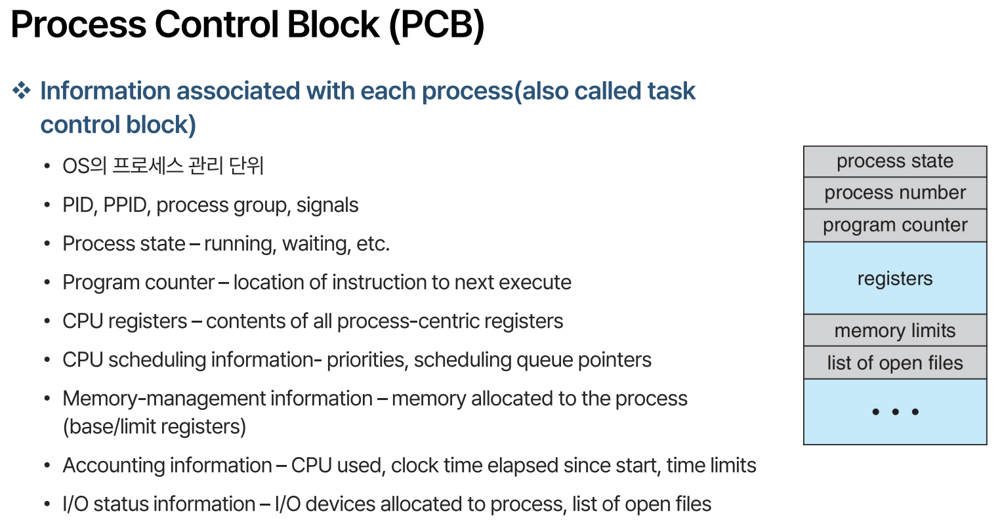
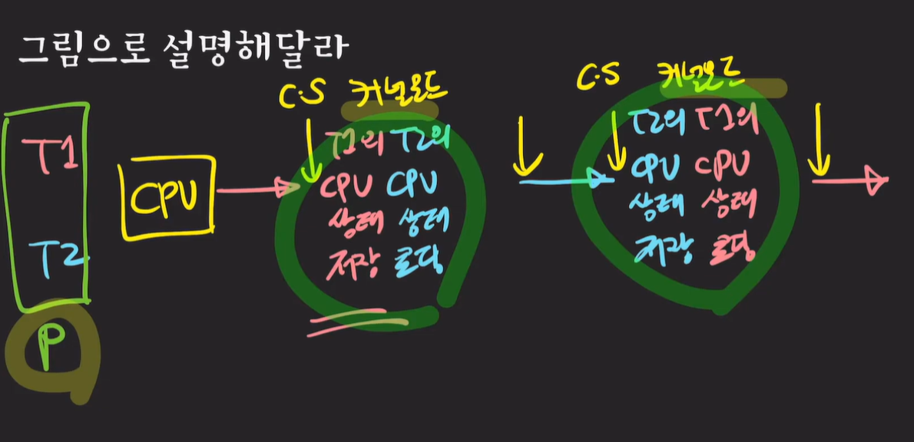
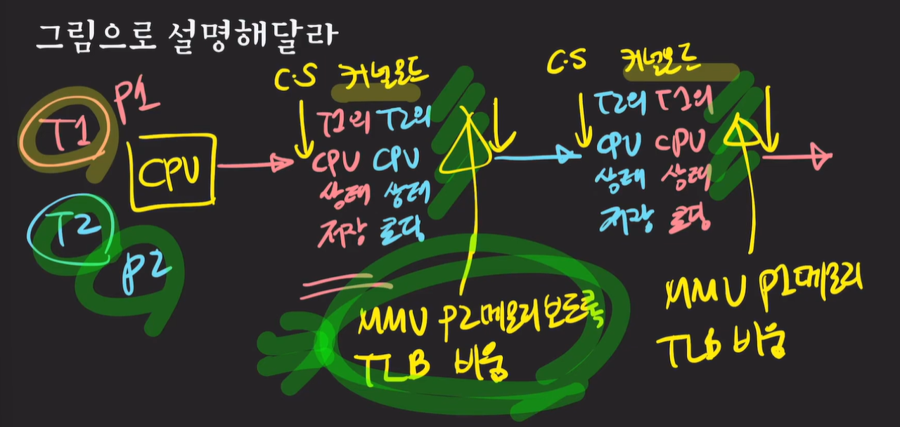

### 컨텍스트 스위칭(Context Switching)이란?

CPU/코어에서 실행 중이던 프로세스/스레드가 다른 프로세스/스레드로 교체되는 것

프로세스에서 프로세스로 교체된다? 서로 다른 프로세스 소속인 스레드 간의 교체가 일어난다.

그럼 **컨택스트(context)**란?

- 프로세스의 상태
- CPU, 메모리 등등 → CPU는 기본적으로 register로 이루어짐. 별도 공부할 것. 무엇이 있고 어떤 기능

### 컨텍스트 스위칭은 왜 필요한가?

여러 프레세스/스레드를 동시에 실행시키기 위해서

**Concurrency 보장**

### 컨텍스트 스위칭은 언제 발생하는가?

- 주어진 time slice(quantum)을 다 사용했거나
- IO 작업을 해야 하거나
- 다른 리소스를 기다리거나
- 인터럽트, … 등

### 예제) 멀티태스킹 시스템에서 컨텍스트 스위칭

멀티태스킹 복습: CPU time은 아주 짧은 time slice를 프로세스 간에 나눠 가지며 실행되는 것.

### 컨텍스트 스위칭은 누구에 의해 실행되는가?

**OS 커널**: 각종 리소스를 관리/감독하는 역할

**커널**이 가장 핵심적인 기능을 담당 !!

### (중요)컨텍스트 스위칭은 구체적으로 어떤 과정으로 일어나는가

다른 프로세스 간의 스위칭인지, → **Process Context Switching**

같은 프로세스의 스레드 간의 스위칭인지에 따라 다르다 → **Thread Context Switching**

**둘의 공통점**

1. **커널 모드**에서 실행 : 컴퓨터의 여러 리소스를 다뤄야 하면 프로세스가 직접 리소스에 접근하는 것이 아닌 운영체제에서도 **커널이 통제권**을 가지고 실행된다.
2. CPU의 레지스터 상태를 교체
    
    예를 들어 P1과 P2 간의 교체가 이뤄졌을 때 CPU 내의 레지스터의 여러 값들이 변경되야 한다.
    
    P1의 상태를 저장해야 나중에 돌아왔을 때 다시 실행할 수 있으니..
    

**둘의 차이점**

프로세스 컨텍스트 스위칭은 **가상 메모리 주소 관련 처리**를 추가 수행(동일 프로세스 내면 공유가 되지만..)

→ MMU, TLB를 바꿔야 하는데 이는 추가로 공부해봐라

가상 메모리 주소 관련 처리에는 **MMU**와 **TLB**가 있다.

1. MMU(Memory Management Unit)

CPU의 하드웨어. 가상 주소를 물리 주소로 변경한다. CPU는 가상 주소만 바라보기에 컨텍스트 스위칭이 발생하면 MMU의 가상 주소가 가리키는 프로세스를 변경할 필요가 있다.

1. TLB(Translation Lookaside Buffer)

가상 메모리를 가지는 시스템은 Page Table을 Level 만큼 접근해야 하는 점이 단점인데, 이를 Caching한 것이 TLB 이다. (가상 주소에 맞는 물리 주소를 찾기 위해선 PageTable을 모두 봐야 한다.)

TLB는 MMU가 가상 주소를 물리 주소로 변환한 결과를 임시적으로 저장하는 캐시이다.

MMU의 가상 주소가 변하면 TLB의 캐시도 초기화할 필요가 있다.

- TLB miss → Page Table을 확인
- TLB hit → 바로 실제 주소 할당

**PCB(Process Control Block)** 자료구조로 프로세스들을 관리한다.

**예시**

1. 동일 프로세스의 스레드 컨텍스트 스위칭

컨텍스트 스위칭 시점에 아래 동작이 실행된다.

- 커널 모드 진입
- 현재 스레드 정보 저장
- 불러올 스레드 정보 로딩

동일 프로세스이기 때문에 별도 메모리 로딩 작업이 필요없다.

1. 프로세스 간의 컨텍스트 스위칭

초록색 빗금 영역에서 

- MMU(Memory Management Unit)가 P2 바라보도록 변경
- cache TLB를 비워준다.

위 과정이 없으면 P2가 P1의 메모리 주소 영역에 접근해버릴 수 있다.

서로 다른 프로세스 간의 컨텍스트 스위칭은 부가적인 메모리 접근이 필요하다.

### 스레드 컨텍스트 스위칭이 더 빠른 이유는?

CPU 상태 정보만 바꾸면 되고

메모리 주소 관련 처리를 하지 않기 때문이다.

### 컨텍스트 스위칭이 미치는 간접적인 영향은?

**캐시 오염(Cache Pollution)**

CPU는 Cache를 가지고 있다. memory는 CPU의 Cache에 접근을 하는데 컨텍스트 스위칭 직후에는 CPU의 cache에 내가 원하는 정보가 없을 가능성이 높다! 다른 프로세스이기 때문에 메모리 영역을 공유하지 않기 때문

캐시 오염 때문에 컨텍스트 스위칭 직후에는 Cache miss가 빈번히 발생하고 이로 인해 메모리 접근 횟수가 증가하게 될 것이다.

### 유저 관점에서 컨텍스트 스위칭이란?

**순수한 오버헤드(pure overhead)**

그냥 간접 비용. 많이 일어나면 좋지 않다