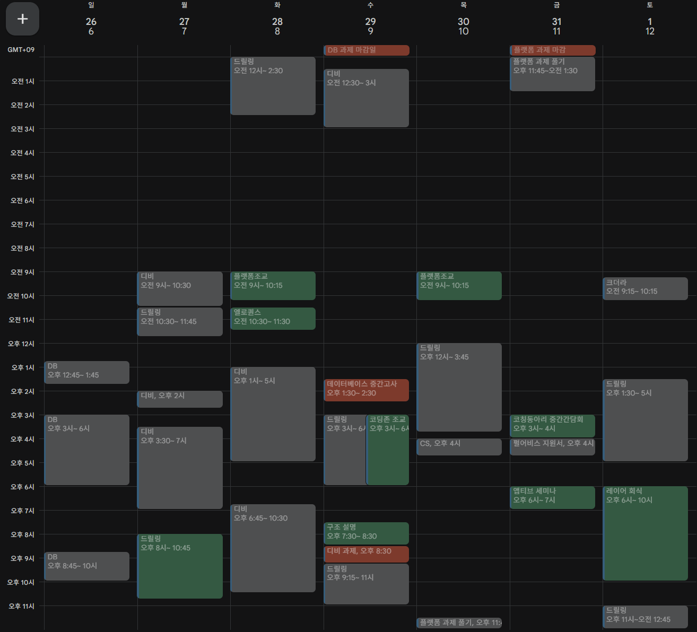

# 25년 10월 5차를 돌아보며

---

정말 간만에 회고를 쓰게 되었다. 앞으로는 매주 일요일은 꾸준히 자신을 돌아보고 다음을 계획하는 날로 삼겠다.

10월 5주차 회고이지만 그 동안의 인생에 대한 회고를 해봐야겠다. 마지막을 4월이니 벌써 6개월이나 지나버린 회고이다.

우선 ‘마기’ 게임을 완성했다. 비록 애시당초 계획한 스팀 출시! 게임 대박! 공모전 대박!은 실패했다. 하지만 1년의 프로젝트를 무사히 완성하고 마무리할 수 있다는 점은 솔직히 기쁘다.  실망스럽긴 하나 어찌됐건 마무리 했으니 다음을 달려가야 겠다.

다음은 ‘크더라’ 게임이다. 아직 마무리가 되지 않은 상태고 다음 주에 크더라를 마무리할 계획이다. 이것도 졸업해야지. 그리고 이건 꽤나 게임성이 있다고 생각이 들어서 출시까지도 고려하면 좋을 것 같다.

마지막으로 현재 진행 중인 ‘드릴링’ 이다. 아마 회고에 등장한 적이 없는 프로젝트일건데, ‘드릴링’은 25년 2학기 앱티브 22기 게임 프로젝트로, 현재 순항 중에 있다. 모두 최선을 다하고 있고 계획대로 잘 이루어지고 있다. 반드시 성공해보자. 책임을 지자!

이제 이번 주 회고 시작하자.

이번 주는 수요일 데이터베이스 과목 중간 고사 대비와 드릴링 개발이 주를 이루었다. 그리고 간간이 있는 동아리 활동들이 있었다. 금요일에는 앱티브 2차 세미나에서 드릴링 개발 진행 과정을 공유했고, 토요일에는 ‘레이어’ 활동 마무리 회식을 진행했다. 회식에는 6명이나 왔고(꽤 왔다고 생각했다.) 고기 1차 술 2차 23만원 쓴 날이다. 지원금 20만원 다 쓰고 인턴하는 팀원이 나머지를 사줬다.

또한 다짐을 했다.

일요일은 반드시 자신을 돌아보는 날로 사용하자고. 일요일은 **회고**를 쓰고, 그 간 배운 것을 **복습**하고, **독서**를 하자. 이렇게 쌓인 일요일들은 나중에 큰 힘이 될 것이라 생각한다.

# 25년 11월 1주차를 바라보며

---

### TODO

- 드릴링 합쳐서 동작하는 게임 만들기
- CS 공부
- 펄어비스 인턴십 지원

### KEEP

- 일찍 자고 일찍 일어나기

### QUESTION

스스로 잘 성실히 살아가고 있지?