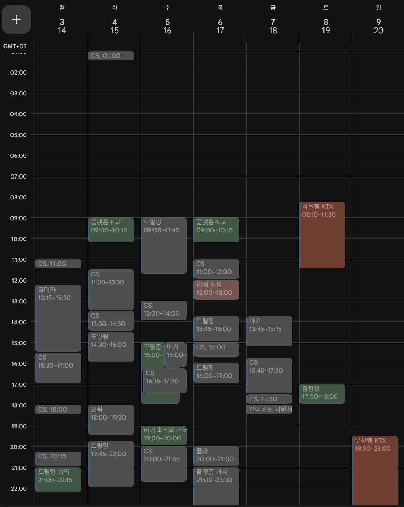

# 25년 11월 1주차를 돌아보며

---

저번 주에 회고 시작하고 이제 정신차리고 열심히 살자! 라는 생각이 들어서 꽤 열심히 했던 것 같다.

그리고 처음 시작한 ‘마기 최적화 스터디’는 꽤나 재미있었고, 스터디원 한 명이 굉장히 열심히 해와서 나도 열심히 하고자 하는 동기부여가 생긴 것 같다.

‘드릴링’ 개발은 순조롭게 되고 있다. 다만 요즘 했던 고민은, 팀원들의 기능을 합치는 역할을 내가 하고 있었는데, 작업 속도가 내가 하면 금방 할 것 같은데 지체되는 느낌이 있는 것 같아서 ‘그냥 내가 할까?’ 라는 고민이 있었다. 하지만 팀원들이 하는 걸 도와주고 후임 양성(?) 느낌으로 지켜보는 것도 좋겠다고 생각했다. 나 혼자 하는 개발이 아니기에 이 편이 팀 전체의 이득일 것 같다.

CS 공부를 하고 있다. OS 강의를 드디어 다 시청했고, **복습**을 해야 하고, 네트워크 공부도 시작해야 한다. 다만 ‘쉬운코드’ 유튜브 강의에는 네트워크 관련 영상이 많지 않아 예전 **강의 자료를 보고 공부**해야 할 듯 하다.

주말 동안은 서울 여행을 떠나서 재미나게 놀고 왔던 것 같다. 이태원도 처음 가보고(ICCAS 팀원이 추천한 식당을 가봤다.) 리움 미술관도 가봤다. 근데 그닥 재미는 없더라. 전시회는 내 취향은 아니다.. 그리고 침착맨 팝업스토어를 방문해서 행복한 시간을 보냈다~ 좀 빨리 나온 느낌이 있어서 아쉽긴 했는데, 그래도 사진은 많이 남겼으니 좋다. 성수에서 유명한 ‘코끼리베이글’ 가서 쉬다가 스테이크 친구가 사줘서 맛있게 먹고 광운대 쪽 자취방 갔다. 그냥 잘까 하다가 그래도 서울까지 왔는데 써울 친구들이랑 술 좀 먹고 노래방 때리고 그러고 잤다. 담 날은 통인시장 가서 엽전으로 음식 사먹기를 했는데 그게 참 좋았다. 여기는 히트다히트 

### TODO

- 드릴링 합쳐서 동작하는 게임 만들기
    
    → 인벤토리-광석을 아직 합치지 못해서 이번 주에는 합쳐야 한다
    
- CS 공부
    
    → 계속 학습하고 복습을 위해 Anki에 넣어놓자
    
- 펄어비스 인턴십 지원
    
    → 11.13 (목) 까지는 마무리를 하자.
    

### KEEP

- 일찍 자고 일찍 일어나기
    
    → 나름 잘 지키고 있다. 어제도 12시반에 
    

### QUESTION

Q. 스스로 잘 성실히 살아가고 있지?

A. 나름 잘 살고 있는 것 같아. 근데 더 열심히 살아야 해.

# 25년 11월 2주차를 바라보며

---

### TODO

- 업그레이드 기능까지 추가된 드릴링 개발하기
- 펄어비스 지원서 마무리
- 코테 준비

### KEEP

- 행복하자
- 열심히 살자

### QUESTION

Q. 드릴링 게임 재미있지? 다른 사람한테도 보여주자!!