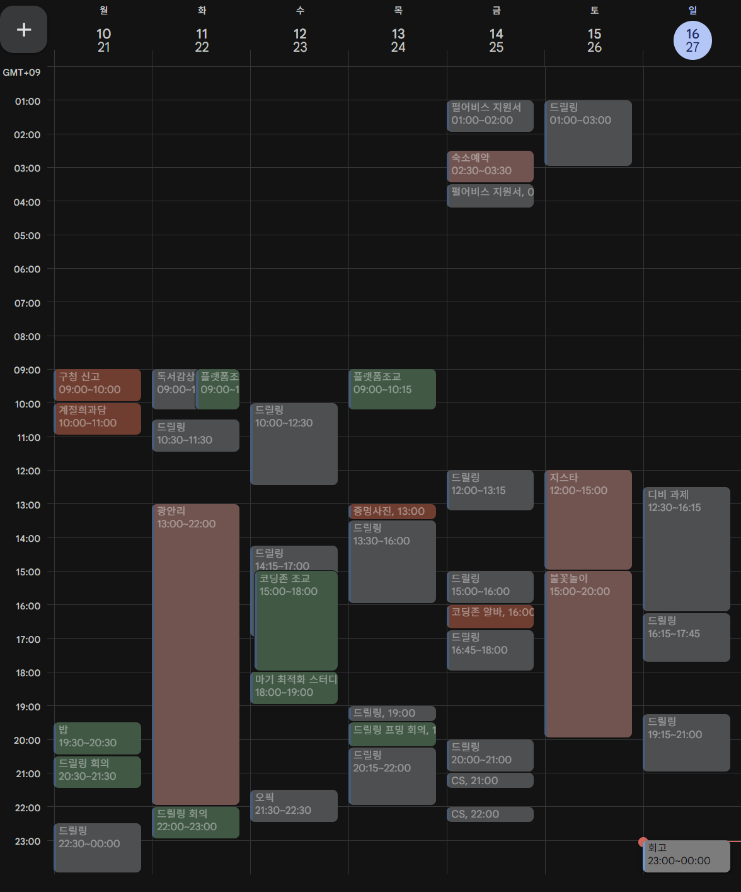

# 25년 11월 2주차를 돌아보며

---

드릴링 게임 개발을 많이 했다. 요즘 들어 젤 재미있는 활동이 게임 개발이다. 익숙하고 그나마 잘하는 것이라 재미있게 느껴지는 것 같다.

CS, 오픽 공부를 소홀히 했다. 게임 개발이 재미있다 보니 그냥 게임 개발만 했다. 이것도 뭐 좋다고 생각한다. 하지만 할 건 해야지. 다음 주부터는 게임 개발을 좀 줄이더라도 할 거를 먼저 하자. ‘우선순위’를 설정하자.

1위는 오픽이다. 2위는 알고리즘(백준 문제)이다. 3위부터는 똑같이 멀티 스레딩 해야겠다.

광안리를 2번이나 갔다. 한 번은 만화카페, 밥, 술, 카페 진솔된 얘기도 많이 한 시간이였고, 한 번은 지스타 25 쭉 돌고 인생 처음으로 광안리 불꽃축제를 봤다.

지스타 25는 볼 거리가 많았고 지인이 부스를 하는게 신기해서 기억에 남는다. 케리아도 멀리서 봤다.

불꽃축제는 내 발로는 처음 가보는데 매년 가고 싶을 정도로 황홀했다. 사람이 많긴 한데 집을 못 갈 정도로 많진 않았다. 내년의 나를 위해 꿀팁을 좀 써보겠다.

**3시에 도착해서 기다렸는데 5시쯤에 가도 자리는 있을 것 같다.**

- 모래 사장에 앉을 것이 아니라면 적당히 천천히 가도 될 것 같다. 이번에는 3시에 도착했는데 그럴 필요는 없다.

이번에는 운 좋게 잘 챙겼는데 준비물을 잘 챙기자

- 돗자리, 담요, 보조배터리, 핫팩, 양산 따뜻한 옷은 필수 아이템이다.
- 패드를 챙기자. 기다리는 동안 지루하니까 넷플릭스 보면 시간 잘 가더라

광안역, 금련산역으로 귀가가 아닌 수영역을 이용하자.

- 당연하게도 사람이 지하철에 완전 몰린다. 하지만 걸어서 수영역 3호선을 탄다면 2호선 보다는 빠르게 집에 갈 수 있다.
- 만약 동해선을 타야한다면 수영역 3호선을 타고 거제에서 환승해서 가자. 동해선 벡스코역에는 사람이 엄청 많은데 나는 앉아갈 수 있다.

### TODO

- 업그레이드 기능까지 추가된 드릴링 개발하기
    
    스토어 기능 확인을 아직 못했다. 적어도 내일까지는 합치고 확인하자.
    
- 펄어비스 지원서 마무리
    
    지원 했고, 코테 안내를 기다리자.
    
- 코테 준비
    
    이번 주에는 열심히 안 했다. 다음 주부터는 초심 잡고 해야 한다. 뭐가 중요한지를 생각해라.
    

### KEEP

- 행복하자
    
    행복하긴 해.
    
- 열심히 살자
    
    나름 열심히 사나? 모르겠다. 더 열심히 살아보
    

### 지난 주 QUESTION

Q. 드릴링 게임 재미있지? 다른 사람한테도 보여주자!!

A. 아직 못 보여줬어.. 다음주에 빌드해서 뿌려야지

# 25년 11월 3주차를 바라보며

---

### TODO

- 드릴링 게임 답게 만들어야 해. 이제 2주 정도 남았는데 그 동안 빡세게 달려보자.
- 코테 준비, 오픽 준비 월~목이라도 빼지 않고 수행해보자! 이거는 해야지 너가 사람이면

### KEEP

- 중간 중간 스트레칭 잘하고 러닝하고 건강을 지키면서 개발하자.

### QUESTION

Q. 영도 여행 잘 다녀왔나?? 재미있게 시간 보냈으면 좋겠네.