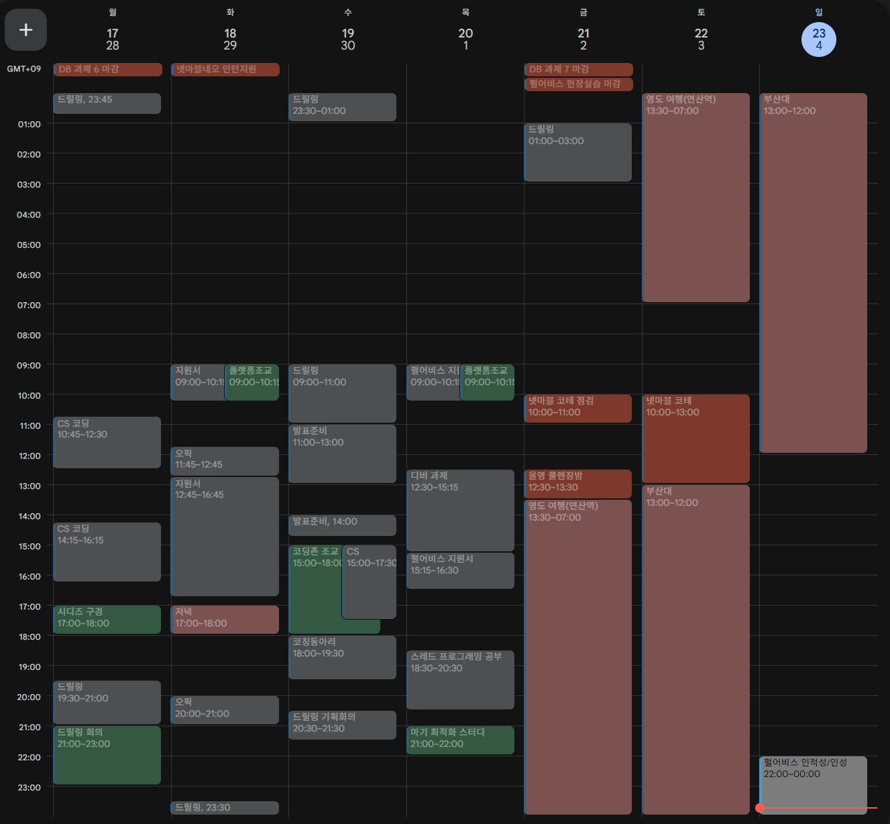

# 25년 11월 3주차를 돌아보며

---

이번 주는 ‘넷마블네오’와 ‘펄어비스’ 지원서 작성 및 코딩테스트가 대부분을 차지했다. 특히 펄어비스는 처음으로 서류를 합격해서 꽤나 기분이 좋았다고 할 수 있다. 다만 서류에서 기뻐할 단계가 아니라는 것을 깨닫고 일단 기다리기로 했다.

이번주는 3일의 휴가가 있었는데, 금토일 동안 영도 및 플스를 하며 시간을 보냈다. 아주 즐거웠고 만족스러웠다. 다음 주부터는 정말 날씨가 추워질텐데, 그러기 전에 다녀와서 다행이라는 생각도 든다.

영도에서는 흰여울 문화마을에서 즐기고, 호텔에서 오션뷰를 즐기며 이재모피자를 먹었다. 아주 좋았고, 다시 부산대 자취방으로 돌아와서는 ‘It takes two’ 게임을 드디어 즐기면서 행복한 시간을 보냈다. 게임하는 걸 즐겨서 참 다행이다.

### TODO

- 드릴링 게임 답게 만들어야 해. 이제 2주 정도 남았는데 그 동안 빡세게 달려보자.
    - → 드릴링에 대해서는 막 많이 하지는 못했지만, 팀원들이 열심히 해서 충분히 목표에 맞출 수 있을 것 같다.
- 코테 준비, 오픽 준비 월~목이라도 빼지 않고 수행해보자! 이거는 해야지 너가 사람이면
    - → 솔직히 하는게 많아서 오픽 준비를 또 못했다. 이제는 익숙한 핑계이다….. 진짜 해야 해 진짜!!!!

### KEEP

- 중간 중간 스트레칭 잘하고 러닝하고 건강을 지키면서 개발하자.
    - 스트레칭 잘 안 한 거 같긴 해. 계속 해내자.

### 지난 주 QUESTION

Q. 영도 여행 잘 다녀왔나?? 재미있게 시간 보냈으면 좋겠네.

A. 너무 즐거운 시간이었고~ 부산대에서도 재밌었어.

# 25년 11월 4주차를 바라보며

---

### TODO

- 드릴링 목표치까지 완성 이끌기
- 오픽 공부 5일 이상 하기

### KEEP

- 일찍 일어나기
- 행복하게 살기

### QUESTION

Q. 오픽 공부 했지??? 안 했으면 그냥 아주 그냥